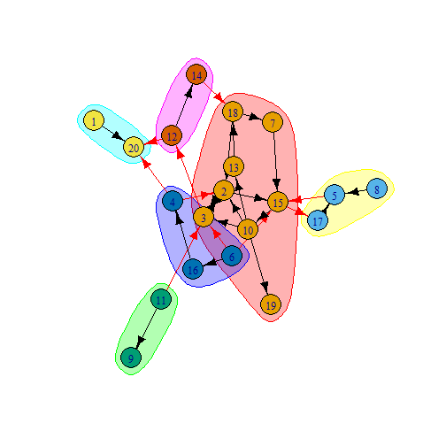
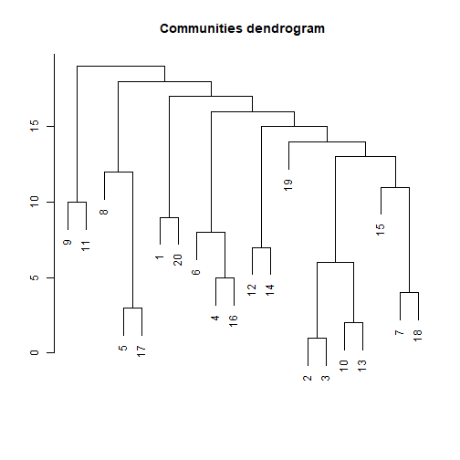
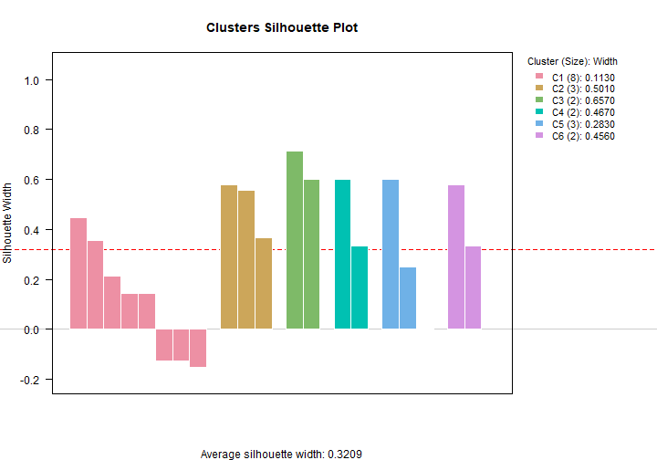

```{=html}
<style type="text/css">
.main-container {
  max-width: 1800px;
  margin-left: auto;
  margin-right: auto;
}
</style>
```
```{=html}
<style type="text/css">
pre {
    border-style: hidden;
}
</style>
```


# Graph level indices

Below you will find a table to determine the foundational indices of a
graph at the graph-level.

<!--html_preserve--><div id="xciznqxwwt" style="padding-left:0px;padding-right:0px;padding-top:10px;padding-bottom:10px;overflow-x:auto;overflow-y:auto;width:auto;height:auto;">
<style>#xciznqxwwt table {
  font-family: system-ui, 'Segoe UI', Roboto, Helvetica, Arial, sans-serif, 'Apple Color Emoji', 'Segoe UI Emoji', 'Segoe UI Symbol', 'Noto Color Emoji';
  -webkit-font-smoothing: antialiased;
  -moz-osx-font-smoothing: grayscale;
}

#xciznqxwwt thead, #xciznqxwwt tbody, #xciznqxwwt tfoot, #xciznqxwwt tr, #xciznqxwwt td, #xciznqxwwt th {
  border-style: none;
}

#xciznqxwwt p {
  margin: 0;
  padding: 0;
}

#xciznqxwwt .gt_table {
  display: table;
  border-collapse: collapse;
  line-height: normal;
  margin-left: auto;
  margin-right: auto;
  color: #333333;
  font-size: 16px;
  font-weight: normal;
  font-style: normal;
  background-color: #FFFFFF;
  width: auto;
  border-top-style: solid;
  border-top-width: 2px;
  border-top-color: #A8A8A8;
  border-right-style: none;
  border-right-width: 2px;
  border-right-color: #D3D3D3;
  border-bottom-style: solid;
  border-bottom-width: 3px;
  border-bottom-color: #FFFFFF;
  border-left-style: none;
  border-left-width: 2px;
  border-left-color: #D3D3D3;
}

#xciznqxwwt .gt_caption {
  padding-top: 4px;
  padding-bottom: 4px;
}

#xciznqxwwt .gt_title {
  color: #333333;
  font-size: 125%;
  font-weight: initial;
  padding-top: 4px;
  padding-bottom: 4px;
  padding-left: 5px;
  padding-right: 5px;
  border-bottom-color: #FFFFFF;
  border-bottom-width: 0;
}

#xciznqxwwt .gt_subtitle {
  color: #333333;
  font-size: 85%;
  font-weight: initial;
  padding-top: 3px;
  padding-bottom: 5px;
  padding-left: 5px;
  padding-right: 5px;
  border-top-color: #FFFFFF;
  border-top-width: 0;
}

#xciznqxwwt .gt_heading {
  background-color: #FFFFFF;
  text-align: center;
  border-bottom-color: #FFFFFF;
  border-left-style: none;
  border-left-width: 1px;
  border-left-color: #D3D3D3;
  border-right-style: none;
  border-right-width: 1px;
  border-right-color: #D3D3D3;
}

#xciznqxwwt .gt_bottom_border {
  border-bottom-style: solid;
  border-bottom-width: 2px;
  border-bottom-color: #D3D3D3;
}

#xciznqxwwt .gt_col_headings {
  border-top-style: solid;
  border-top-width: 2px;
  border-top-color: #D3D3D3;
  border-bottom-style: solid;
  border-bottom-width: 2px;
  border-bottom-color: #D3D3D3;
  border-left-style: none;
  border-left-width: 1px;
  border-left-color: #D3D3D3;
  border-right-style: none;
  border-right-width: 1px;
  border-right-color: #D3D3D3;
}

#xciznqxwwt .gt_col_heading {
  color: #333333;
  background-color: #FFFFFF;
  font-size: 100%;
  font-weight: normal;
  text-transform: inherit;
  border-left-style: none;
  border-left-width: 1px;
  border-left-color: #D3D3D3;
  border-right-style: none;
  border-right-width: 1px;
  border-right-color: #D3D3D3;
  vertical-align: bottom;
  padding-top: 5px;
  padding-bottom: 6px;
  padding-left: 5px;
  padding-right: 5px;
  overflow-x: hidden;
}

#xciznqxwwt .gt_column_spanner_outer {
  color: #333333;
  background-color: #FFFFFF;
  font-size: 100%;
  font-weight: normal;
  text-transform: inherit;
  padding-top: 0;
  padding-bottom: 0;
  padding-left: 4px;
  padding-right: 4px;
}

#xciznqxwwt .gt_column_spanner_outer:first-child {
  padding-left: 0;
}

#xciznqxwwt .gt_column_spanner_outer:last-child {
  padding-right: 0;
}

#xciznqxwwt .gt_column_spanner {
  border-bottom-style: solid;
  border-bottom-width: 2px;
  border-bottom-color: #D3D3D3;
  vertical-align: bottom;
  padding-top: 5px;
  padding-bottom: 5px;
  overflow-x: hidden;
  display: inline-block;
  width: 100%;
}

#xciznqxwwt .gt_spanner_row {
  border-bottom-style: hidden;
}

#xciznqxwwt .gt_group_heading {
  padding-top: 8px;
  padding-bottom: 8px;
  padding-left: 5px;
  padding-right: 5px;
  color: #333333;
  background-color: #FFFFFF;
  font-size: 100%;
  font-weight: initial;
  text-transform: inherit;
  border-top-style: solid;
  border-top-width: 2px;
  border-top-color: #D3D3D3;
  border-bottom-style: solid;
  border-bottom-width: 2px;
  border-bottom-color: #D3D3D3;
  border-left-style: none;
  border-left-width: 1px;
  border-left-color: #D3D3D3;
  border-right-style: none;
  border-right-width: 1px;
  border-right-color: #D3D3D3;
  vertical-align: middle;
  text-align: left;
}

#xciznqxwwt .gt_empty_group_heading {
  padding: 0.5px;
  color: #333333;
  background-color: #FFFFFF;
  font-size: 100%;
  font-weight: initial;
  border-top-style: solid;
  border-top-width: 2px;
  border-top-color: #D3D3D3;
  border-bottom-style: solid;
  border-bottom-width: 2px;
  border-bottom-color: #D3D3D3;
  vertical-align: middle;
}

#xciznqxwwt .gt_from_md > :first-child {
  margin-top: 0;
}

#xciznqxwwt .gt_from_md > :last-child {
  margin-bottom: 0;
}

#xciznqxwwt .gt_row {
  padding-top: 5px;
  padding-bottom: 5px;
  padding-left: 20px;
  padding-right: 20px;
  margin: 10px;
  border-top-style: dotted;
  border-top-width: 1px;
  border-top-color: #D3D3D3;
  border-left-style: none;
  border-left-width: 1px;
  border-left-color: #D3D3D3;
  border-right-style: none;
  border-right-width: 1px;
  border-right-color: #D3D3D3;
  vertical-align: middle;
  overflow-x: hidden;
}

#xciznqxwwt .gt_stub {
  color: #333333;
  background-color: #FFFFFF;
  font-size: 100%;
  font-weight: initial;
  text-transform: inherit;
  border-right-style: solid;
  border-right-width: 2px;
  border-right-color: #D3D3D3;
  padding-left: 20px;
  padding-right: 20px;
}

#xciznqxwwt .gt_stub_row_group {
  color: #333333;
  background-color: #FFFFFF;
  font-size: 100%;
  font-weight: initial;
  text-transform: inherit;
  border-right-style: solid;
  border-right-width: 2px;
  border-right-color: #D3D3D3;
  padding-left: 5px;
  padding-right: 5px;
  vertical-align: top;
}

#xciznqxwwt .gt_row_group_first td {
  border-top-width: 2px;
}

#xciznqxwwt .gt_row_group_first th {
  border-top-width: 2px;
}

#xciznqxwwt .gt_summary_row {
  color: #333333;
  background-color: #FFFFFF;
  text-transform: inherit;
  padding-top: 8px;
  padding-bottom: 8px;
  padding-left: 5px;
  padding-right: 5px;
}

#xciznqxwwt .gt_first_summary_row {
  border-top-style: solid;
  border-top-color: #D3D3D3;
}

#xciznqxwwt .gt_first_summary_row.thick {
  border-top-width: 2px;
}

#xciznqxwwt .gt_last_summary_row {
  padding-top: 8px;
  padding-bottom: 8px;
  padding-left: 5px;
  padding-right: 5px;
  border-bottom-style: solid;
  border-bottom-width: 2px;
  border-bottom-color: #D3D3D3;
}

#xciznqxwwt .gt_grand_summary_row {
  color: #333333;
  background-color: #FFFFFF;
  text-transform: inherit;
  padding-top: 8px;
  padding-bottom: 8px;
  padding-left: 5px;
  padding-right: 5px;
}

#xciznqxwwt .gt_first_grand_summary_row {
  padding-top: 8px;
  padding-bottom: 8px;
  padding-left: 5px;
  padding-right: 5px;
  border-top-style: double;
  border-top-width: 6px;
  border-top-color: #D3D3D3;
}

#xciznqxwwt .gt_last_grand_summary_row_top {
  padding-top: 8px;
  padding-bottom: 8px;
  padding-left: 5px;
  padding-right: 5px;
  border-bottom-style: double;
  border-bottom-width: 6px;
  border-bottom-color: #D3D3D3;
}

#xciznqxwwt .gt_striped {
  background-color: rgba(128, 128, 128, 0.05);
}

#xciznqxwwt .gt_table_body {
  border-top-style: solid;
  border-top-width: 2px;
  border-top-color: #D3D3D3;
  border-bottom-style: solid;
  border-bottom-width: 2px;
  border-bottom-color: #D3D3D3;
}

#xciznqxwwt .gt_footnotes {
  color: #333333;
  background-color: #FFFFFF;
  border-bottom-style: none;
  border-bottom-width: 2px;
  border-bottom-color: #D3D3D3;
  border-left-style: none;
  border-left-width: 2px;
  border-left-color: #D3D3D3;
  border-right-style: none;
  border-right-width: 2px;
  border-right-color: #D3D3D3;
}

#xciznqxwwt .gt_footnote {
  margin: 0px;
  font-size: 90%;
  padding-top: 4px;
  padding-bottom: 4px;
  padding-left: 5px;
  padding-right: 5px;
}

#xciznqxwwt .gt_sourcenotes {
  color: #333333;
  background-color: #FFFFFF;
  border-bottom-style: none;
  border-bottom-width: 2px;
  border-bottom-color: #D3D3D3;
  border-left-style: none;
  border-left-width: 2px;
  border-left-color: #D3D3D3;
  border-right-style: none;
  border-right-width: 2px;
  border-right-color: #D3D3D3;
}

#xciznqxwwt .gt_sourcenote {
  font-size: 90%;
  padding-top: 4px;
  padding-bottom: 4px;
  padding-left: 5px;
  padding-right: 5px;
}

#xciznqxwwt .gt_left {
  text-align: left;
}

#xciznqxwwt .gt_center {
  text-align: center;
}

#xciznqxwwt .gt_right {
  text-align: right;
  font-variant-numeric: tabular-nums;
}

#xciznqxwwt .gt_font_normal {
  font-weight: normal;
}

#xciznqxwwt .gt_font_bold {
  font-weight: bold;
}

#xciznqxwwt .gt_font_italic {
  font-style: italic;
}

#xciznqxwwt .gt_super {
  font-size: 65%;
}

#xciznqxwwt .gt_footnote_marks {
  font-size: 75%;
  vertical-align: 0.4em;
  position: initial;
}

#xciznqxwwt .gt_asterisk {
  font-size: 100%;
  vertical-align: 0;
}

#xciznqxwwt .gt_indent_1 {
  text-indent: 5px;
}

#xciznqxwwt .gt_indent_2 {
  text-indent: 10px;
}

#xciznqxwwt .gt_indent_3 {
  text-indent: 15px;
}

#xciznqxwwt .gt_indent_4 {
  text-indent: 20px;
}

#xciznqxwwt .gt_indent_5 {
  text-indent: 25px;
}

#xciznqxwwt .katex-display {
  display: inline-flex !important;
  margin-bottom: 0.75em !important;
}

#xciznqxwwt div.Reactable > div.rt-table > div.rt-thead > div.rt-tr.rt-tr-group-header > div.rt-th-group:after {
  height: 0px !important;
}
</style>
<table class="gt_table" data-quarto-disable-processing="false" data-quarto-bootstrap="false">
  <thead>
    <tr class="gt_heading">
      <td colspan="2" class="gt_heading gt_title gt_font_normal gt_bottom_border" style="font-family: Helvetica; font-size: xx-large; text-align: center;">Explore the graph</td>
    </tr>
    
  </thead>
  <tbody class="gt_table_body">
    <tr class="gt_group_heading_row">
      <th colspan="2" class="gt_group_heading" style="font-size: medium; text-align: left; font-weight: bold; text-transform: uppercase;" scope="colgroup" id="Summarize the network">Summarize the network</th>
    </tr>
    <tr class="gt_row_group_first"><td headers="Summarize the network  pkg" class="gt_row gt_left">snafun</td>
<td headers="Summarize the network  code" class="gt_row gt_left"><div style="white-space: pre-wrap; font-family: monospace;">
    snafun::g_summary(x, directed = TRUE)
    </div></td></tr>
    <tr><td headers="Summarize the network  pkg" class="gt_row gt_left">igraph</td>
<td headers="Summarize the network  code" class="gt_row gt_left"><div style="white-space: pre-wrap; font-family: monospace;">—</div></td></tr>
    <tr><td headers="Summarize the network  pkg" class="gt_row gt_left">network</td>
<td headers="Summarize the network  code" class="gt_row gt_left"><div style="white-space: pre-wrap; font-family: monospace;">—</div></td></tr>
    <tr class="gt_group_heading_row">
      <th colspan="2" class="gt_group_heading" style="font-size: medium; text-align: left; font-weight: bold; text-transform: uppercase;" scope="colgroup" id="Count the number of vertices">Count the number of vertices</th>
    </tr>
    <tr class="gt_row_group_first"><td headers="Count the number of vertices  pkg" class="gt_row gt_left">snafun</td>
<td headers="Count the number of vertices  code" class="gt_row gt_left"><div style="white-space: pre-wrap; font-family: monospace;">
    snafun::count_vertices(x)
    </div></td></tr>
    <tr><td headers="Count the number of vertices  pkg" class="gt_row gt_left">igraph</td>
<td headers="Count the number of vertices  code" class="gt_row gt_left"><div style="white-space: pre-wrap; font-family: monospace;">
    igraph::vcount()
    </div></td></tr>
    <tr><td headers="Count the number of vertices  pkg" class="gt_row gt_left">network</td>
<td headers="Count the number of vertices  code" class="gt_row gt_left"><div style="white-space: pre-wrap; font-family: monospace;">
    network::network.size()
    
    </div></td></tr>
    <tr class="gt_group_heading_row">
      <th colspan="2" class="gt_group_heading" style="font-size: medium; text-align: left; font-weight: bold; text-transform: uppercase;" scope="colgroup" id="Count the number of edges">Count the number of edges</th>
    </tr>
    <tr class="gt_row_group_first"><td headers="Count the number of edges  pkg" class="gt_row gt_left">snafun</td>
<td headers="Count the number of edges  code" class="gt_row gt_left"><div style="white-space: pre-wrap; font-family: monospace;">
    snafun::count_edges(x)
    </div></td></tr>
    <tr><td headers="Count the number of edges  pkg" class="gt_row gt_left">igraph</td>
<td headers="Count the number of edges  code" class="gt_row gt_left"><div style="white-space: pre-wrap; font-family: monospace;">
    igraph::ecount(x)
    igraph::gsize(x)
    </div></td></tr>
    <tr><td headers="Count the number of edges  pkg" class="gt_row gt_left">network</td>
<td headers="Count the number of edges  code" class="gt_row gt_left"><div style="white-space: pre-wrap; font-family: monospace;">
    network::network.edgecount(x)
    
    </div></td></tr>
    <tr class="gt_group_heading_row">
      <th colspan="2" class="gt_group_heading" style="font-size: medium; text-align: left; font-weight: bold; text-transform: uppercase;" scope="colgroup" id="Density">Density</th>
    </tr>
    <tr class="gt_row_group_first"><td headers="Density  pkg" class="gt_row gt_left">snafun</td>
<td headers="Density  code" class="gt_row gt_left"><div style="white-space: pre-wrap; font-family: monospace;">
    snafun::g_density(x, loops = FALSE)
    </div></td></tr>
    <tr><td headers="Density  pkg" class="gt_row gt_left">igraph</td>
<td headers="Density  code" class="gt_row gt_left"><div style="white-space: pre-wrap; font-family: monospace;">
    igraph::edge_density(g)
    </div></td></tr>
    <tr><td headers="Density  pkg" class="gt_row gt_left">network</td>
<td headers="Density  code" class="gt_row gt_left"><div style="white-space: pre-wrap; font-family: monospace;">
    # preferable for biprartite graphs
    network::network_density(g)

    # preferable for valued graphs
    sna::gden(g)
    </div></td></tr>
    <tr class="gt_group_heading_row">
      <th colspan="2" class="gt_group_heading" style="font-size: medium; text-align: left; font-weight: bold; text-transform: uppercase;" scope="colgroup" id="Reciprocity">Reciprocity</th>
    </tr>
    <tr class="gt_row_group_first"><td headers="Reciprocity  pkg" class="gt_row gt_left">snafun</td>
<td headers="Reciprocity  code" class="gt_row gt_left"><div style="white-space: pre-wrap; font-family: monospace;">
    snafun::g_reciprocity(x)
    </div></td></tr>
    <tr><td headers="Reciprocity  pkg" class="gt_row gt_left">igraph</td>
<td headers="Reciprocity  code" class="gt_row gt_left"><div style="white-space: pre-wrap; font-family: monospace;">
    igraph::reciprocity(g)
    </div></td></tr>
    <tr><td headers="Reciprocity  pkg" class="gt_row gt_left">network</td>
<td headers="Reciprocity  code" class="gt_row gt_left"><div style="white-space: pre-wrap; font-family: monospace;">
    sna::grecip(g,'measure = 'edgewise')
    </div></td></tr>
    <tr class="gt_group_heading_row">
      <th colspan="2" class="gt_group_heading" style="font-size: medium; text-align: left; font-weight: bold; text-transform: uppercase;" scope="colgroup" id="Transitivity">Transitivity</th>
    </tr>
    <tr class="gt_row_group_first"><td headers="Transitivity  pkg" class="gt_row gt_left">snafun</td>
<td headers="Transitivity  code" class="gt_row gt_left"><div style="white-space: pre-wrap; font-family: monospace;">
    snafun::g_transitivity(x)
    </div></td></tr>
    <tr><td headers="Transitivity  pkg" class="gt_row gt_left">igraph</td>
<td headers="Transitivity  code" class="gt_row gt_left"><div style="white-space: pre-wrap; font-family: monospace;">
    igraph::transitivity(g, type = 'global')
    </div></td></tr>
    <tr><td headers="Transitivity  pkg" class="gt_row gt_left">network</td>
<td headers="Transitivity  code" class="gt_row gt_left"><div style="white-space: pre-wrap; font-family: monospace;">
    sna::gtrans(g, mode = 'digraph', measure = 'weak', use.adjacency = TRUE)
    </div></td></tr>
    <tr class="gt_group_heading_row">
      <th colspan="2" class="gt_group_heading" style="font-size: medium; text-align: left; font-weight: bold; text-transform: uppercase;" scope="colgroup" id="Mean distance between vertices">Mean distance between vertices</th>
    </tr>
    <tr class="gt_row_group_first"><td headers="Mean distance between vertices  pkg" class="gt_row gt_left">snafun</td>
<td headers="Mean distance between vertices  code" class="gt_row gt_left"><div style="white-space: pre-wrap; font-family: monospace;">
    snafun::g_mean_distance(x)
    </div></td></tr>
    <tr><td headers="Mean distance between vertices  pkg" class="gt_row gt_left">igraph</td>
<td headers="Mean distance between vertices  code" class="gt_row gt_left"><div style="white-space: pre-wrap; font-family: monospace;">
    igraph::mean_distance(g, directed = TRUE, unconnected = TRUE)
    </div></td></tr>
    <tr><td headers="Mean distance between vertices  pkg" class="gt_row gt_left">network</td>
<td headers="Mean distance between vertices  code" class="gt_row gt_left"><div style="white-space: pre-wrap; font-family: monospace;">—</div></td></tr>
    <tr class="gt_group_heading_row">
      <th colspan="2" class="gt_group_heading" style="font-size: medium; text-align: left; font-weight: bold; text-transform: uppercase;" scope="colgroup" id="Degree distribution">Degree distribution</th>
    </tr>
    <tr class="gt_row_group_first"><td headers="Degree distribution  pkg" class="gt_row gt_left">snafun</td>
<td headers="Degree distribution  code" class="gt_row gt_left"><div style="white-space: pre-wrap; font-family: monospace;">
    snafun::g_degree_distribution(x, mode = c("out", "in", "all"),
                                  type = c("density", "count"),
                                  cumulative = FALSE, 
                                  loops = FALSE,
                                  digits = 3)
    </div></td></tr>
    <tr><td headers="Degree distribution  pkg" class="gt_row gt_left">igraph</td>
<td headers="Degree distribution  code" class="gt_row gt_left"><div style="white-space: pre-wrap; font-family: monospace;">
    igraph::degree_distribution(graph, cumulative = FALSE, mode = 'out')
    </div></td></tr>
    <tr><td headers="Degree distribution  pkg" class="gt_row gt_left">network</td>
<td headers="Degree distribution  code" class="gt_row gt_left"><div style="white-space: pre-wrap; font-family: monospace;">—</div></td></tr>
    <tr class="gt_group_heading_row">
      <th colspan="2" class="gt_group_heading" style="font-size: medium; text-align: left; font-weight: bold; text-transform: uppercase;" scope="colgroup" id="Dyad census">Dyad census</th>
    </tr>
    <tr class="gt_row_group_first"><td headers="Dyad census  pkg" class="gt_row gt_left">snafun</td>
<td headers="Dyad census  code" class="gt_row gt_left"><div style="white-space: pre-wrap; font-family: monospace;">
    snafun::count_dyads(x, echo = TRUE)
    </div></td></tr>
    <tr><td headers="Dyad census  pkg" class="gt_row gt_left">igraph</td>
<td headers="Dyad census  code" class="gt_row gt_left"><div style="white-space: pre-wrap; font-family: monospace;">
    igraph::dyad_census(g)
    </div></td></tr>
    <tr><td headers="Dyad census  pkg" class="gt_row gt_left">network</td>
<td headers="Dyad census  code" class="gt_row gt_left"><div style="white-space: pre-wrap; font-family: monospace;">
    sna::dyad.census(g)
    </div></td></tr>
    <tr class="gt_group_heading_row">
      <th colspan="2" class="gt_group_heading" style="font-size: medium; text-align: left; font-weight: bold; text-transform: uppercase;" scope="colgroup" id="Triad census">Triad census</th>
    </tr>
    <tr class="gt_row_group_first"><td headers="Triad census  pkg" class="gt_row gt_left">snafun</td>
<td headers="Triad census  code" class="gt_row gt_left"><div style="white-space: pre-wrap; font-family: monospace;">
    snafun::count_triads(x, echo = TRUE)
    </div></td></tr>
    <tr><td headers="Triad census  pkg" class="gt_row gt_left">igraph</td>
<td headers="Triad census  code" class="gt_row gt_left"><div style="white-space: pre-wrap; font-family: monospace;">
    igraph::triad_census(g)
    </div></td></tr>
    <tr><td headers="Triad census  pkg" class="gt_row gt_left">network</td>
<td headers="Triad census  code" class="gt_row gt_left"><div style="white-space: pre-wrap; font-family: monospace;">
    sna::triad.census(g, mode = 'digraph')
    </div></td></tr>
    <tr class="gt_group_heading_row">
      <th colspan="2" class="gt_group_heading" style="font-size: medium; text-align: left; font-weight: bold; text-transform: uppercase;" scope="colgroup" id="Degree assortativity">Degree assortativity</th>
    </tr>
    <tr class="gt_row_group_first"><td headers="Degree assortativity  pkg" class="gt_row gt_left">snafun</td>
<td headers="Degree assortativity  code" class="gt_row gt_left"><div style="white-space: pre-wrap; font-family: monospace;">—</div></td></tr>
    <tr><td headers="Degree assortativity  pkg" class="gt_row gt_left">igraph</td>
<td headers="Degree assortativity  code" class="gt_row gt_left"><div style="white-space: pre-wrap; font-family: monospace;">
    igraph::assortativity_degree(g, directed = TRUE)
    </div></td></tr>
    <tr><td headers="Degree assortativity  pkg" class="gt_row gt_left">network</td>
<td headers="Degree assortativity  code" class="gt_row gt_left"><div style="white-space: pre-wrap; font-family: monospace;">—</div></td></tr>
    <tr class="gt_group_heading_row">
      <th colspan="2" class="gt_group_heading" style="font-size: medium; text-align: left; font-weight: bold; text-transform: uppercase;" scope="colgroup" id="Diameter">Diameter</th>
    </tr>
    <tr class="gt_row_group_first"><td headers="Diameter  pkg" class="gt_row gt_left">snafun</td>
<td headers="Diameter  code" class="gt_row gt_left"><div style="white-space: pre-wrap; font-family: monospace;">
    snafun::g_diameter(x, directed = is_directed(x), unconnected = TRUE)
    </div></td></tr>
    <tr><td headers="Diameter  pkg" class="gt_row gt_left">igraph</td>
<td headers="Diameter  code" class="gt_row gt_left"><div style="white-space: pre-wrap; font-family: monospace;">
    igraph::diameter(g, directed = TRUE, unconnected = TRUE)

    # what is the vertex pair with the longest geodesic
    igraph::farthest_vertices(g)
    </div></td></tr>
    <tr><td headers="Diameter  pkg" class="gt_row gt_left">network</td>
<td headers="Diameter  code" class="gt_row gt_left"><div style="white-space: pre-wrap; font-family: monospace;">—</div></td></tr>
    <tr class="gt_group_heading_row">
      <th colspan="2" class="gt_group_heading" style="font-size: medium; text-align: left; font-weight: bold; text-transform: uppercase;" scope="colgroup" id="Radius">Radius</th>
    </tr>
    <tr class="gt_row_group_first"><td headers="Radius  pkg" class="gt_row gt_left">snafun</td>
<td headers="Radius  code" class="gt_row gt_left"><div style="white-space: pre-wrap; font-family: monospace;">
    snafun::g_radius(x, mode = c("all", "out", "in"))
    </div></td></tr>
    <tr><td headers="Radius  pkg" class="gt_row gt_left">igraph</td>
<td headers="Radius  code" class="gt_row gt_left"><div style="white-space: pre-wrap; font-family: monospace;">
    igraph::radius(graph, mode = c("all", "out", "in", "total"))
    </div></td></tr>
    <tr><td headers="Radius  pkg" class="gt_row gt_left">network</td>
<td headers="Radius  code" class="gt_row gt_left"><div style="white-space: pre-wrap; font-family: monospace;">—</div></td></tr>
    <tr class="gt_group_heading_row">
      <th colspan="2" class="gt_group_heading" style="font-size: medium; text-align: left; font-weight: bold; text-transform: uppercase;" scope="colgroup" id="Compactness">Compactness</th>
    </tr>
    <tr class="gt_row_group_first"><td headers="Compactness  pkg" class="gt_row gt_left">snafun</td>
<td headers="Compactness  code" class="gt_row gt_left"><div style="white-space: pre-wrap; font-family: monospace;">
    snafun::g_compactness(x, mode = c("out", "in", "all"))
    </div></td></tr>
    <tr><td headers="Compactness  pkg" class="gt_row gt_left">igraph</td>
<td headers="Compactness  code" class="gt_row gt_left"><div style="white-space: pre-wrap; font-family: monospace;">—</div></td></tr>
    <tr><td headers="Compactness  pkg" class="gt_row gt_left">network</td>
<td headers="Compactness  code" class="gt_row gt_left"><div style="white-space: pre-wrap; font-family: monospace;">—</div></td></tr>
    <tr class="gt_group_heading_row">
      <th colspan="2" class="gt_group_heading" style="font-size: medium; text-align: left; font-weight: bold; text-transform: uppercase;" scope="colgroup" id="Centralization">Centralization</th>
    </tr>
    <tr class="gt_row_group_first"><td headers="Centralization  pkg" class="gt_row gt_left">snafun</td>
<td headers="Centralization  code" class="gt_row gt_left"><div style="white-space: pre-wrap; font-family: monospace;">
    # a single function to calculate centralization (either `Freeman` or `sd`)
    # on a wide range of centrality indices

    snafun::g_centralize(x, measure = "betweenness",
      directed = TRUE, mode = c("all", "out", "in"),
      k = 3, damping = 0.85, normalized = TRUE,
      method = c("freeman", "sd"))
    </div></td></tr>
    <tr><td headers="Centralization  pkg" class="gt_row gt_left">igraph<span class="gt_footnote_marks" style="white-space:nowrap;font-style:italic;font-weight:normal;line-height:0;"><sup>1,2</sup></span></td>
<td headers="Centralization  code" class="gt_row gt_left"><div style="white-space: pre-wrap; font-family: monospace;">
    # general function for Freeman centralization
    igraph::centralize(scores, theoretical.max = 0, normalized = TRUE)
     
    # betweenness centralization
    igraph::centr_betw(g, directed = TRUE)
    
    # closeness centralization
    igraph::centr_clo(g, mode = 'out', normalized = FALSE)
     
    # degree centralization
    igraph::centr_degree(g, mode = 'all')
    
    # eigenvector centralization
    igraph::centr_eigen(g, directed = TRUE)
    </div></td></tr>
    <tr><td headers="Centralization  pkg" class="gt_row gt_left">network<span class="gt_footnote_marks" style="white-space:nowrap;font-style:italic;font-weight:normal;line-height:0;"><sup>1</sup></span></td>
<td headers="Centralization  code" class="gt_row gt_left"><div style="white-space: pre-wrap; font-family: monospace;">
    # general function for Freeman centralization,
    # include any function that calculates vertex centrality
    sna::centralization(g, FUN, mode = 'digraph', normalize=TRUE, ...)
    </div></td></tr>
    <tr class="gt_group_heading_row">
      <th colspan="2" class="gt_group_heading" style="font-size: medium; text-align: left; font-weight: bold; text-transform: uppercase;" scope="colgroup" id="Mixing matrix">Mixing matrix</th>
    </tr>
    <tr class="gt_row_group_first"><td headers="Mixing matrix  pkg" class="gt_row gt_left">snafun</td>
<td headers="Mixing matrix  code" class="gt_row gt_left"><div style="white-space: pre-wrap; font-family: monospace;">
    snafun::make_mixingmatrix(x, attrname, by_edge = FALSE, loops = has_loops(x))
    </div></td></tr>
    <tr><td headers="Mixing matrix  pkg" class="gt_row gt_left">igraph</td>
<td headers="Mixing matrix  code" class="gt_row gt_left"><div style="white-space: pre-wrap; font-family: monospace;">—</div></td></tr>
    <tr><td headers="Mixing matrix  pkg" class="gt_row gt_left">network</td>
<td headers="Mixing matrix  code" class="gt_row gt_left"><div style="white-space: pre-wrap; font-family: monospace;">
    network::mixingmatrix(object, attrname, useNA = "ifany", expand.bipartite = FALSE)
    </div></td></tr>
    <tr class="gt_group_heading_row">
      <th colspan="2" class="gt_group_heading" style="font-size: medium; text-align: left; font-weight: bold; text-transform: uppercase;" scope="colgroup" id="Correlation between two graphs">Correlation between two graphs</th>
    </tr>
    <tr class="gt_row_group_first"><td headers="Correlation between two graphs  pkg" class="gt_row gt_left">snafun</td>
<td headers="Correlation between two graphs  code" class="gt_row gt_left"><div style="white-space: pre-wrap; font-family: monospace;">
    snafun::g_correlation(g1, g2, diag = FALSE)
    </div></td></tr>
    <tr><td headers="Correlation between two graphs  pkg" class="gt_row gt_left">igraph</td>
<td headers="Correlation between two graphs  code" class="gt_row gt_left"><div style="white-space: pre-wrap; font-family: monospace;">—</div></td></tr>
    <tr><td headers="Correlation between two graphs  pkg" class="gt_row gt_left">network</td>
<td headers="Correlation between two graphs  code" class="gt_row gt_left"><div style="white-space: pre-wrap; font-family: monospace;">
    sna::gcor(g1, g2, mode = 'graph')
    </div></td></tr>
    <tr class="gt_group_heading_row">
      <th colspan="2" class="gt_group_heading" style="font-size: medium; text-align: left; font-weight: bold; text-transform: uppercase;" scope="colgroup" id="Fast-greedy community detection">Fast-greedy community detection</th>
    </tr>
    <tr class="gt_row_group_first"><td headers="Fast-greedy community detection  pkg" class="gt_row gt_left">snafun</td>
<td headers="Fast-greedy community detection  code" class="gt_row gt_left"><div style="white-space: pre-wrap; font-family: monospace;">
    snafun::extract_comm_fastgreedy(x, weights = NA, modularity = TRUE, 
      merges = TRUE, membership = TRUE)
    </div></td></tr>
    <tr><td headers="Fast-greedy community detection  pkg" class="gt_row gt_left">igraph</td>
<td headers="Fast-greedy community detection  code" class="gt_row gt_left"><div style="white-space: pre-wrap; font-family: monospace;">
    igraph::cluster_fast_greedy(g, merges = TRUE, modularity = TRUE,
      membership = TRUE, weights = NULL)
    </div></td></tr>
    <tr><td headers="Fast-greedy community detection  pkg" class="gt_row gt_left">network</td>
<td headers="Fast-greedy community detection  code" class="gt_row gt_left"><div style="white-space: pre-wrap; font-family: monospace;">—</div></td></tr>
    <tr class="gt_group_heading_row">
      <th colspan="2" class="gt_group_heading" style="font-size: medium; text-align: left; font-weight: bold; text-transform: uppercase;" scope="colgroup" id="Girvan-Newman community detection">Girvan-Newman community detection</th>
    </tr>
    <tr class="gt_row_group_first"><td headers="Girvan-Newman community detection  pkg" class="gt_row gt_left">snafun</td>
<td headers="Girvan-Newman community detection  code" class="gt_row gt_left"><div style="white-space: pre-wrap; font-family: monospace;">
    snafun::extract_comm_girvan(x, weights = NA, directed = TRUE, modularity = TRUE,
      edge.betweenness = FALSE, bridges = FALSE, merges = TRUE, membership = TRUE)
    </div></td></tr>
    <tr><td headers="Girvan-Newman community detection  pkg" class="gt_row gt_left">igraph</td>
<td headers="Girvan-Newman community detection  code" class="gt_row gt_left"><div style="white-space: pre-wrap; font-family: monospace;">
    igraph::cluster_edge_betweenness(g, weights = NULL, directed = TRUE, edge.betweenness = TRUE,
      merges = TRUE, bridges = TRUE, modularity = TRUE, membership = TRUE)
    </div></td></tr>
    <tr><td headers="Girvan-Newman community detection  pkg" class="gt_row gt_left">network</td>
<td headers="Girvan-Newman community detection  code" class="gt_row gt_left"><div style="white-space: pre-wrap; font-family: monospace;">—</div></td></tr>
    <tr class="gt_group_heading_row">
      <th colspan="2" class="gt_group_heading" style="font-size: medium; text-align: left; font-weight: bold; text-transform: uppercase;" scope="colgroup" id="Louvain community detection">Louvain community detection</th>
    </tr>
    <tr class="gt_row_group_first"><td headers="Louvain community detection  pkg" class="gt_row gt_left">snafun</td>
<td headers="Louvain community detection  code" class="gt_row gt_left"><div style="white-space: pre-wrap; font-family: monospace;">
    snafun::extract_comm_louvain(x, weights = NA, resolution = 1)
    </div></td></tr>
    <tr><td headers="Louvain community detection  pkg" class="gt_row gt_left">igraph</td>
<td headers="Louvain community detection  code" class="gt_row gt_left"><div style="white-space: pre-wrap; font-family: monospace;">
    igraph::cluster_louvain(graph, weights = NULL, resolution = 1)
    </div></td></tr>
    <tr><td headers="Louvain community detection  pkg" class="gt_row gt_left">network</td>
<td headers="Louvain community detection  code" class="gt_row gt_left"><div style="white-space: pre-wrap; font-family: monospace;">—</div></td></tr>
    <tr class="gt_group_heading_row">
      <th colspan="2" class="gt_group_heading" style="font-size: medium; text-align: left; font-weight: bold; text-transform: uppercase;" scope="colgroup" id="Walktrap community detection">Walktrap community detection</th>
    </tr>
    <tr class="gt_row_group_first"><td headers="Walktrap community detection  pkg" class="gt_row gt_left">snafun</td>
<td headers="Walktrap community detection  code" class="gt_row gt_left"><div style="white-space: pre-wrap; font-family: monospace;">
    snafun::extract_comm_walktrap(x, weights = NA, steps = 4, modularity = TRUE,
      merges = TRUE, membership = TRUE)
    </div></td></tr>
    <tr><td headers="Walktrap community detection  pkg" class="gt_row gt_left">igraph</td>
<td headers="Walktrap community detection  code" class="gt_row gt_left"><div style="white-space: pre-wrap; font-family: monospace;">
    igraph::cluster_walktrap(g, weights = NULL, steps = 4, merges = TRUE, modularity = TRUE, 
      membership = TRUE)
    </div></td></tr>
    <tr><td headers="Walktrap community detection  pkg" class="gt_row gt_left">network</td>
<td headers="Walktrap community detection  code" class="gt_row gt_left"><div style="white-space: pre-wrap; font-family: monospace;">—</div></td></tr>
    <tr class="gt_group_heading_row">
      <th colspan="2" class="gt_group_heading" style="font-size: medium; text-align: left; font-weight: bold; text-transform: uppercase;" scope="colgroup" id="Merge community membership">Merge community membership</th>
    </tr>
    <tr class="gt_row_group_first"><td headers="Merge community membership  pkg" class="gt_row gt_left">snafun</td>
<td headers="Merge community membership  code" class="gt_row gt_left"><div style="white-space: pre-wrap; font-family: monospace;">
    snafun::merge_membership(coms, merges)
    </div></td></tr>
    <tr><td headers="Merge community membership  pkg" class="gt_row gt_left">igraph</td>
<td headers="Merge community membership  code" class="gt_row gt_left"><div style="white-space: pre-wrap; font-family: monospace;">—</div></td></tr>
    <tr><td headers="Merge community membership  pkg" class="gt_row gt_left">network</td>
<td headers="Merge community membership  code" class="gt_row gt_left"><div style="white-space: pre-wrap; font-family: monospace;">—</div></td></tr>
    <tr class="gt_group_heading_row">
      <th colspan="2" class="gt_group_heading" style="font-size: medium; text-align: left; font-weight: bold; text-transform: uppercase;" scope="colgroup" id="Community membership">Community membership</th>
    </tr>
    <tr class="gt_row_group_first"><td headers="Community membership  pkg" class="gt_row gt_left">snafun</td>
<td headers="Community membership  code" class="gt_row gt_left"><div style="white-space: pre-wrap; font-family: monospace;">
    snafun::extract_comm_membership(coms)
    </div></td></tr>
    <tr><td headers="Community membership  pkg" class="gt_row gt_left">igraph</td>
<td headers="Community membership  code" class="gt_row gt_left"><div style="white-space: pre-wrap; font-family: monospace;">
    igraph::membership(coms)
    </div></td></tr>
    <tr><td headers="Community membership  pkg" class="gt_row gt_left">network</td>
<td headers="Community membership  code" class="gt_row gt_left"><div style="white-space: pre-wrap; font-family: monospace;">—</div></td></tr>
    <tr class="gt_group_heading_row">
      <th colspan="2" class="gt_group_heading" style="font-size: medium; text-align: left; font-weight: bold; text-transform: uppercase;" scope="colgroup" id="Number of communities">Number of communities</th>
    </tr>
    <tr class="gt_row_group_first"><td headers="Number of communities  pkg" class="gt_row gt_left">snafun</td>
<td headers="Number of communities  code" class="gt_row gt_left"><div style="white-space: pre-wrap; font-family: monospace;">
    snafun::count_communities(coms)
    </div></td></tr>
    <tr><td headers="Number of communities  pkg" class="gt_row gt_left">igraph</td>
<td headers="Number of communities  code" class="gt_row gt_left"><div style="white-space: pre-wrap; font-family: monospace;">
    length(coms)
    </div></td></tr>
    <tr><td headers="Number of communities  pkg" class="gt_row gt_left">network</td>
<td headers="Number of communities  code" class="gt_row gt_left"><div style="white-space: pre-wrap; font-family: monospace;">—</div></td></tr>
    <tr class="gt_group_heading_row">
      <th colspan="2" class="gt_group_heading" style="font-size: medium; text-align: left; font-weight: bold; text-transform: uppercase;" scope="colgroup" id="Community sizes">Community sizes</th>
    </tr>
    <tr class="gt_row_group_first"><td headers="Community sizes  pkg" class="gt_row gt_left">snafun</td>
<td headers="Community sizes  code" class="gt_row gt_left"><div style="white-space: pre-wrap; font-family: monospace;">
    snafun::extract_comm_sizes(coms)
    </div></td></tr>
    <tr><td headers="Community sizes  pkg" class="gt_row gt_left">igraph</td>
<td headers="Community sizes  code" class="gt_row gt_left"><div style="white-space: pre-wrap; font-family: monospace;">
    igraph::sizes(coms)
    </div></td></tr>
    <tr><td headers="Community sizes  pkg" class="gt_row gt_left">network</td>
<td headers="Community sizes  code" class="gt_row gt_left"><div style="white-space: pre-wrap; font-family: monospace;">—</div></td></tr>
    <tr class="gt_group_heading_row">
      <th colspan="2" class="gt_group_heading" style="font-size: medium; text-align: left; font-weight: bold; text-transform: uppercase;" scope="colgroup" id="Community modularity">Community modularity</th>
    </tr>
    <tr class="gt_row_group_first"><td headers="Community modularity  pkg" class="gt_row gt_left">snafun</td>
<td headers="Community modularity  code" class="gt_row gt_left"><div style="white-space: pre-wrap; font-family: monospace;">
    snafun::extract_comm_modularity(coms)
    </div></td></tr>
    <tr><td headers="Community modularity  pkg" class="gt_row gt_left">igraph</td>
<td headers="Community modularity  code" class="gt_row gt_left"><div style="white-space: pre-wrap; font-family: monospace;">
    igraph::modularity(coms)
    </div></td></tr>
    <tr><td headers="Community modularity  pkg" class="gt_row gt_left">network</td>
<td headers="Community modularity  code" class="gt_row gt_left"><div style="white-space: pre-wrap; font-family: monospace;">—</div></td></tr>
    <tr class="gt_group_heading_row">
      <th colspan="2" class="gt_group_heading" style="font-size: medium; text-align: left; font-weight: bold; text-transform: uppercase;" scope="colgroup" id="Community crossing ties">Community crossing ties</th>
    </tr>
    <tr class="gt_row_group_first"><td headers="Community crossing ties  pkg" class="gt_row gt_left">snafun</td>
<td headers="Community crossing ties  code" class="gt_row gt_left"><div style="white-space: pre-wrap; font-family: monospace;">
    snafun::extract_comm_crossing(coms, graph)
    </div></td></tr>
    <tr><td headers="Community crossing ties  pkg" class="gt_row gt_left">igraph</td>
<td headers="Community crossing ties  code" class="gt_row gt_left"><div style="white-space: pre-wrap; font-family: monospace;">
    igraph::crossing(coms, graph)
    </div></td></tr>
    <tr><td headers="Community crossing ties  pkg" class="gt_row gt_left">network</td>
<td headers="Community crossing ties  code" class="gt_row gt_left"><div style="white-space: pre-wrap; font-family: monospace;">—</div></td></tr>
    <tr class="gt_group_heading_row">
      <th colspan="2" class="gt_group_heading" style="font-size: medium; text-align: left; font-weight: bold; text-transform: uppercase;" scope="colgroup" id="Evaluate communities">Evaluate communities</th>
    </tr>
    <tr class="gt_row_group_first"><td headers="Evaluate communities  pkg" class="gt_row gt_left">snafun</td>
<td headers="Evaluate communities  code" class="gt_row gt_left"><div style="white-space: pre-wrap; font-family: monospace;">
    snafun::evaluate_communities(coms, graph, sil_width = FALSE)
    </div></td></tr>
    <tr><td headers="Evaluate communities  pkg" class="gt_row gt_left">igraph</td>
<td headers="Evaluate communities  code" class="gt_row gt_left"><div style="white-space: pre-wrap; font-family: monospace;">—</div></td></tr>
    <tr><td headers="Evaluate communities  pkg" class="gt_row gt_left">network</td>
<td headers="Evaluate communities  code" class="gt_row gt_left"><div style="white-space: pre-wrap; font-family: monospace;">—</div></td></tr>
    <tr class="gt_group_heading_row">
      <th colspan="2" class="gt_group_heading" style="font-size: medium; text-align: left; font-weight: bold; text-transform: uppercase;" scope="colgroup" id="Plot silhouette widths for communities">Plot silhouette widths for communities</th>
    </tr>
    <tr class="gt_row_group_first"><td headers="Plot silhouette widths for communities  pkg" class="gt_row gt_left">snafun</td>
<td headers="Plot silhouette widths for communities  code" class="gt_row gt_left"><div style="white-space: pre-wrap; font-family: monospace;">
    evls &amp;lt;- snafun::evaluate_communities(coms, graph)
    plot(evls)
    </div></td></tr>
    <tr><td headers="Plot silhouette widths for communities  pkg" class="gt_row gt_left">igraph</td>
<td headers="Plot silhouette widths for communities  code" class="gt_row gt_left"><div style="white-space: pre-wrap; font-family: monospace;">—</div></td></tr>
    <tr><td headers="Plot silhouette widths for communities  pkg" class="gt_row gt_left">network</td>
<td headers="Plot silhouette widths for communities  code" class="gt_row gt_left"><div style="white-space: pre-wrap; font-family: monospace;">—</div></td></tr>
    <tr class="gt_group_heading_row">
      <th colspan="2" class="gt_group_heading" style="font-size: medium; text-align: left; font-weight: bold; text-transform: uppercase;" scope="colgroup" id="Plot communities">Plot communities</th>
    </tr>
    <tr class="gt_row_group_first"><td headers="Plot communities  pkg" class="gt_row gt_left">snafun</td>
<td headers="Plot communities  code" class="gt_row gt_left"><div style="white-space: pre-wrap; font-family: monospace;">
    snafun::plot_communities(coms, graph)
    </div></td></tr>
    <tr><td headers="Plot communities  pkg" class="gt_row gt_left">igraph</td>
<td headers="Plot communities  code" class="gt_row gt_left"><div style="white-space: pre-wrap; font-family: monospace;">
    plot(coms, graph)
    </div></td></tr>
    <tr><td headers="Plot communities  pkg" class="gt_row gt_left">network</td>
<td headers="Plot communities  code" class="gt_row gt_left"><div style="white-space: pre-wrap; font-family: monospace;">—</div></td></tr>
    <tr class="gt_group_heading_row">
      <th colspan="2" class="gt_group_heading" style="font-size: medium; text-align: left; font-weight: bold; text-transform: uppercase;" scope="colgroup" id="Add community membership to graph">Add community membership to graph</th>
    </tr>
    <tr class="gt_row_group_first"><td headers="Add community membership to graph  pkg" class="gt_row gt_left">snafun</td>
<td headers="Add community membership to graph  code" class="gt_row gt_left"><div style="white-space: pre-wrap; font-family: monospace;">
    snafun::add_comm_membership(graph, coms, attr = "community")
    </div></td></tr>
    <tr><td headers="Add community membership to graph  pkg" class="gt_row gt_left">igraph</td>
<td headers="Add community membership to graph  code" class="gt_row gt_left"><div style="white-space: pre-wrap; font-family: monospace;">—</div></td></tr>
    <tr><td headers="Add community membership to graph  pkg" class="gt_row gt_left">network</td>
<td headers="Add community membership to graph  code" class="gt_row gt_left"><div style="white-space: pre-wrap; font-family: monospace;">—</div></td></tr>
    <tr class="gt_group_heading_row">
      <th colspan="2" class="gt_group_heading" style="font-size: medium; text-align: left; font-weight: bold; text-transform: uppercase;" scope="colgroup" id="Add community crossing to graph">Add community crossing to graph</th>
    </tr>
    <tr class="gt_row_group_first"><td headers="Add community crossing to graph  pkg" class="gt_row gt_left">snafun</td>
<td headers="Add community crossing to graph  code" class="gt_row gt_left"><div style="white-space: pre-wrap; font-family: monospace;">
    snafun::add_comm_crossing(graph, coms, attr = "crossing")
    </div></td></tr>
    <tr><td headers="Add community crossing to graph  pkg" class="gt_row gt_left">igraph</td>
<td headers="Add community crossing to graph  code" class="gt_row gt_left"><div style="white-space: pre-wrap; font-family: monospace;">—</div></td></tr>
    <tr><td headers="Add community crossing to graph  pkg" class="gt_row gt_left">network</td>
<td headers="Add community crossing to graph  code" class="gt_row gt_left"><div style="white-space: pre-wrap; font-family: monospace;">—</div></td></tr>
  </tbody>
  <tfoot>
    <tr class="gt_footnotes">
      <td class="gt_footnote" colspan="2"><span class="gt_footnote_marks" style="white-space:nowrap;font-style:italic;font-weight:normal;line-height:0;"><sup>1</sup></span> igraph and sna only calculate `Freeman` centralization (snafun 
    does both `Freeman` and `sd`)</td>
    </tr>
    <tr class="gt_footnotes">
      <td class="gt_footnote" colspan="2"><span class="gt_footnote_marks" style="white-space:nowrap;font-style:italic;font-weight:normal;line-height:0;"><sup>2</sup></span> `\$res` or `\$vector` return the centrality scores</td>
    </tr>
  </tfoot>
</table>
</div><!--/html_preserve-->

## Communities and other subgroups

It is informative to know that the `snafun` functions to extract
communities yield results that can be scrutinized by `igraph`. The
`snafun` package is smart enough to do this, regardless of whether the
original input graph was of class `igraph` or `network`. Really handy.

Here's an example.


``` r
# generate a random directed graph with 20 vertices and 30 edges
g <- snafun::create_random_graph(20, "gnm", m = 30)

# determine the walktrap communities
walk <- snafun::extract_comm_walktrap(g)
print(walk)
#> 
#> Community structure object
#> 
#> Algorithm: walktrap 
#> Communities: 6 
#> Vertices: 20 
#> Sizes: 8, 3, 2, 2, 3, 2 
#> Stored modularity: 0.3039 
#> Merge history: yes

# get the modularity score
snafun::extract_comm_modularity(walk)
#> [1] 0.3038889

# membership of each vertex
snafun::extract_comm_membership(walk)
#>  [1] 4 1 1 5 2 5 1 2 3 1 3 6 1 6 1 5 2 1 1 4

# number of communities
snafun::count_communities(walk)
#> [1] 6

# size of each community
snafun::extract_comm_sizes(walk)
#> Community sizes
#> 1 2 3 4 5 6 
#> 8 3 2 2 3 2

# which edge connects multiple communities
snafun::extract_comm_crossing(walk, g)
#>  [1] FALSE FALSE FALSE FALSE  TRUE  TRUE  TRUE  TRUE  TRUE  TRUE FALSE FALSE
#> [13] FALSE FALSE FALSE FALSE FALSE  TRUE FALSE  TRUE FALSE FALSE FALSE  TRUE
#> [25] FALSE  TRUE FALSE FALSE FALSE FALSE

# plot the network, highlighting the communities
snafun::plot_communities(walk, g)
```



If you are so inclined, you can plot the community division as a
dendrogram, as follows:


``` r
snafun::plot_comm_dendrogram(walk)
```



## Writing community results back to the graph

Community detection is often only the first step. In practice, you
usually want to attach the results back to the network so you can use
them in plots, tables, and follow-up analyses.

`snafun` makes this easy:

- `snafun::add_comm_membership()` writes the community membership of
  each vertex back as a vertex attribute.
- `snafun::add_comm_crossing()` writes whether an edge runs between two
  different communities back as an edge attribute.


``` r
g_comm <- snafun::add_comm_membership(g, walk, attr = "community")
g_comm <- snafun::add_comm_crossing(g_comm, walk, attr = "crossing")

snafun::extract_vertex_attribute(g_comm, "community")
#>  [1] 4 1 1 5 2 5 1 2 3 1 3 6 1 6 1 5 2 1 1 4
snafun::extract_edge_attribute(g_comm, "crossing")
#>  [1] FALSE FALSE FALSE FALSE  TRUE  TRUE  TRUE  TRUE  TRUE  TRUE FALSE FALSE
#> [13] FALSE FALSE FALSE FALSE FALSE  TRUE FALSE  TRUE FALSE FALSE FALSE  TRUE
#> [25] FALSE  TRUE FALSE FALSE FALSE FALSE
```

This workflow is especially useful when you want to:

- color vertices by community in a later plot;
- identify bridging edges between communities; or
- compare community structure to other vertex attributes.

## Evaluating community quality

After finding a community structure, you may also want to evaluate how
well-separated the detected communities are. `snafun` can do this with
`evaluate_communities()`.

The function returns a community-level table with:

- `Silhouette`: the average silhouette width of the vertices in that
  community; higher values indicate cleaner separation.
- `Modularity`: the modularity of the full partition; higher values
  indicate relatively many ties within communities and relatively few
  ties between communities.
- `Conductance`: how strongly a community is tied to the rest of the
  graph; lower values are usually better.
- `Density`: how densely connected the vertices are within the
  community itself.


``` r
evls <- snafun::evaluate_communities(walk, g)
evls
#>   Cluster Size Silhouette Modularity Conductance Density
#> 1      C1    8      0.113      0.314       0.308   0.232
#> 2      C2    3      0.501      0.314       0.333   0.333
#> 3      C3    2      0.657      0.314       0.333   0.500
#> 4      C4    2      0.467      0.314       0.500   0.500
#> 5      C5    3      0.283      0.314       0.500   0.333
#> 6      C6    2      0.456      0.314       0.600   0.500
```

If you also want the silhouette width for each individual vertex, set
`sil_width = TRUE`.


``` r
evls2 <- snafun::evaluate_communities(walk, g, sil_width = TRUE)
head(evls2$sil_width)
#>   vertex cluster neighbor sil_width
#> 1      1       4        6     0.600
#> 2      2       1        5     0.143
#> 3      3       1        3    -0.125
#> 4      4       5        4     0.000
#> 5      5       2        1     0.579
#> 6      6       5        1     0.250
```

You can also plot the silhouette widths directly.


``` r
plot(evls)
```



In that plot:

- bars above `0` indicate vertices that fit their own community better
  than neighbouring communities;
- bars near `0` indicate ambiguous or boundary cases;
- bars below `0` indicate vertices that may fit another community
  better than the one they were assigned to;
- the red line shows the overall average silhouette width.

## Bridge centralities between communities

Once you have a community structure, you may also want to know which
vertices act as bridges between those communities. The bridge measures
in `snafun` take the output of `extract_comm_*()` directly, so you can
reuse the `walk` object from above.


``` r
data.frame(
  vertex = snafun::extract_vertex_ids(g),
  bridge_strength = snafun::v_bridge_strength(g, walk),
  bridge_expected_influence = snafun::v_bridge_expected_influence(g, walk),
  bridge_expected_influence2 = snafun::v_bridge_expected_influence2(g, walk),
  bridge_closeness = snafun::v_bridge_closeness(g, walk),
  bridge_betweenness = snafun::v_bridge_betweenness(g, walk)
)
#> Error:
#> ! 'extract_vertex_ids' is not an exported object from 'namespace:snafun'
```

These measures answer slightly different questions:

- `v_bridge_strength()`: how strongly a vertex is directly tied to
  vertices outside its own community.
- `v_bridge_expected_influence()`: like bridge strength, but keeping the
  sign of the edge weights.
- `v_bridge_expected_influence2()`: also includes indirect influence
  through neighbours.
- `v_bridge_closeness()`: how easily a vertex can reach other
  communities via short paths.
- `v_bridge_betweenness()`: how often a vertex lies on shortest paths
  between different communities.

For directed graphs you can choose whether to focus on incoming,
outgoing, or all ties. For example:


``` r
snafun::v_bridge_strength(g, walk, type = "out")
#>  1  2  3  4  5  6  7  8  9 10 11 12 13 14 15 16 17 18 19 20 
#>  0  0  1  2  1  2  0  0  0  0  1  1  0  1  1  0  0  0  0  0
snafun::v_bridge_strength(g, walk, type = "in")
#>  1  2  3  4  5  6  7  8  9 10 11 12 13 14 15 16 17 18 19 20 
#>  0  1  2  0  0  0  0  0  0  0  0  1  0  0  2  0  1  1  0  2
```

For weighted signed social networks, the direct bridge measures use the
weights as they are. The shortest-path bridge measures behave slightly
differently: positive weights are translated into distances via `1 /
weight`, while zero and negative weights are ignored in the path search.
If you want purely topological shortest paths, use `weights = NA`.


``` r
snafun::v_bridge_closeness(g, walk, weights = NA)
#>         1         2         3         4         5         6         7         8 
#>       NaN 0.3846154 0.4166667 0.3095238 0.2894737 0.3823529 0.2631579 0.2244898 
#>         9        10        11        12        13        14        15        16 
#>       NaN 0.3333333 0.2826087 0.2444444 0.2941176 0.2820513 0.3571429 0.2363636 
#>        17        18        19        20 
#> 0.2244898 0.2777778       NaN       NaN
snafun::v_bridge_betweenness(g, walk, weights = NA)
#>  1  2  3  4  5  6  7  8  9 10 11 12 13 14 15 16 17 18 19 20 
#>  0 60 56 16 22  0 16  0  0 55  0 35 12 24 97  1 18 45  0  0
```

# Vertex-level indices

Here are the functions to determine many of the vertex-level indices you
will want to use in this course.

<!--html_preserve--><div id="nmkkvjorcp" style="padding-left:0px;padding-right:0px;padding-top:10px;padding-bottom:10px;overflow-x:auto;overflow-y:auto;width:auto;height:auto;">
<style>#nmkkvjorcp table {
  font-family: system-ui, 'Segoe UI', Roboto, Helvetica, Arial, sans-serif, 'Apple Color Emoji', 'Segoe UI Emoji', 'Segoe UI Symbol', 'Noto Color Emoji';
  -webkit-font-smoothing: antialiased;
  -moz-osx-font-smoothing: grayscale;
}

#nmkkvjorcp thead, #nmkkvjorcp tbody, #nmkkvjorcp tfoot, #nmkkvjorcp tr, #nmkkvjorcp td, #nmkkvjorcp th {
  border-style: none;
}

#nmkkvjorcp p {
  margin: 0;
  padding: 0;
}

#nmkkvjorcp .gt_table {
  display: table;
  border-collapse: collapse;
  line-height: normal;
  margin-left: auto;
  margin-right: auto;
  color: #333333;
  font-size: 16px;
  font-weight: normal;
  font-style: normal;
  background-color: #FFFFFF;
  width: auto;
  border-top-style: solid;
  border-top-width: 2px;
  border-top-color: #A8A8A8;
  border-right-style: none;
  border-right-width: 2px;
  border-right-color: #D3D3D3;
  border-bottom-style: solid;
  border-bottom-width: 3px;
  border-bottom-color: #FFFFFF;
  border-left-style: none;
  border-left-width: 2px;
  border-left-color: #D3D3D3;
}

#nmkkvjorcp .gt_caption {
  padding-top: 4px;
  padding-bottom: 4px;
}

#nmkkvjorcp .gt_title {
  color: #333333;
  font-size: 125%;
  font-weight: initial;
  padding-top: 4px;
  padding-bottom: 4px;
  padding-left: 5px;
  padding-right: 5px;
  border-bottom-color: #FFFFFF;
  border-bottom-width: 0;
}

#nmkkvjorcp .gt_subtitle {
  color: #333333;
  font-size: 85%;
  font-weight: initial;
  padding-top: 3px;
  padding-bottom: 5px;
  padding-left: 5px;
  padding-right: 5px;
  border-top-color: #FFFFFF;
  border-top-width: 0;
}

#nmkkvjorcp .gt_heading {
  background-color: #FFFFFF;
  text-align: center;
  border-bottom-color: #FFFFFF;
  border-left-style: none;
  border-left-width: 1px;
  border-left-color: #D3D3D3;
  border-right-style: none;
  border-right-width: 1px;
  border-right-color: #D3D3D3;
}

#nmkkvjorcp .gt_bottom_border {
  border-bottom-style: solid;
  border-bottom-width: 2px;
  border-bottom-color: #D3D3D3;
}

#nmkkvjorcp .gt_col_headings {
  border-top-style: solid;
  border-top-width: 2px;
  border-top-color: #D3D3D3;
  border-bottom-style: solid;
  border-bottom-width: 2px;
  border-bottom-color: #D3D3D3;
  border-left-style: none;
  border-left-width: 1px;
  border-left-color: #D3D3D3;
  border-right-style: none;
  border-right-width: 1px;
  border-right-color: #D3D3D3;
}

#nmkkvjorcp .gt_col_heading {
  color: #333333;
  background-color: #FFFFFF;
  font-size: 100%;
  font-weight: normal;
  text-transform: inherit;
  border-left-style: none;
  border-left-width: 1px;
  border-left-color: #D3D3D3;
  border-right-style: none;
  border-right-width: 1px;
  border-right-color: #D3D3D3;
  vertical-align: bottom;
  padding-top: 5px;
  padding-bottom: 6px;
  padding-left: 5px;
  padding-right: 5px;
  overflow-x: hidden;
}

#nmkkvjorcp .gt_column_spanner_outer {
  color: #333333;
  background-color: #FFFFFF;
  font-size: 100%;
  font-weight: normal;
  text-transform: inherit;
  padding-top: 0;
  padding-bottom: 0;
  padding-left: 4px;
  padding-right: 4px;
}

#nmkkvjorcp .gt_column_spanner_outer:first-child {
  padding-left: 0;
}

#nmkkvjorcp .gt_column_spanner_outer:last-child {
  padding-right: 0;
}

#nmkkvjorcp .gt_column_spanner {
  border-bottom-style: solid;
  border-bottom-width: 2px;
  border-bottom-color: #D3D3D3;
  vertical-align: bottom;
  padding-top: 5px;
  padding-bottom: 5px;
  overflow-x: hidden;
  display: inline-block;
  width: 100%;
}

#nmkkvjorcp .gt_spanner_row {
  border-bottom-style: hidden;
}

#nmkkvjorcp .gt_group_heading {
  padding-top: 8px;
  padding-bottom: 8px;
  padding-left: 5px;
  padding-right: 5px;
  color: #333333;
  background-color: #FFFFFF;
  font-size: 100%;
  font-weight: initial;
  text-transform: inherit;
  border-top-style: solid;
  border-top-width: 2px;
  border-top-color: #D3D3D3;
  border-bottom-style: solid;
  border-bottom-width: 2px;
  border-bottom-color: #D3D3D3;
  border-left-style: none;
  border-left-width: 1px;
  border-left-color: #D3D3D3;
  border-right-style: none;
  border-right-width: 1px;
  border-right-color: #D3D3D3;
  vertical-align: middle;
  text-align: left;
}

#nmkkvjorcp .gt_empty_group_heading {
  padding: 0.5px;
  color: #333333;
  background-color: #FFFFFF;
  font-size: 100%;
  font-weight: initial;
  border-top-style: solid;
  border-top-width: 2px;
  border-top-color: #D3D3D3;
  border-bottom-style: solid;
  border-bottom-width: 2px;
  border-bottom-color: #D3D3D3;
  vertical-align: middle;
}

#nmkkvjorcp .gt_from_md > :first-child {
  margin-top: 0;
}

#nmkkvjorcp .gt_from_md > :last-child {
  margin-bottom: 0;
}

#nmkkvjorcp .gt_row {
  padding-top: 5px;
  padding-bottom: 5px;
  padding-left: 20px;
  padding-right: 20px;
  margin: 10px;
  border-top-style: dotted;
  border-top-width: 1px;
  border-top-color: #D3D3D3;
  border-left-style: none;
  border-left-width: 1px;
  border-left-color: #D3D3D3;
  border-right-style: none;
  border-right-width: 1px;
  border-right-color: #D3D3D3;
  vertical-align: middle;
  overflow-x: hidden;
}

#nmkkvjorcp .gt_stub {
  color: #333333;
  background-color: #FFFFFF;
  font-size: 100%;
  font-weight: initial;
  text-transform: inherit;
  border-right-style: solid;
  border-right-width: 2px;
  border-right-color: #D3D3D3;
  padding-left: 20px;
  padding-right: 20px;
}

#nmkkvjorcp .gt_stub_row_group {
  color: #333333;
  background-color: #FFFFFF;
  font-size: 100%;
  font-weight: initial;
  text-transform: inherit;
  border-right-style: solid;
  border-right-width: 2px;
  border-right-color: #D3D3D3;
  padding-left: 5px;
  padding-right: 5px;
  vertical-align: top;
}

#nmkkvjorcp .gt_row_group_first td {
  border-top-width: 2px;
}

#nmkkvjorcp .gt_row_group_first th {
  border-top-width: 2px;
}

#nmkkvjorcp .gt_summary_row {
  color: #333333;
  background-color: #FFFFFF;
  text-transform: inherit;
  padding-top: 8px;
  padding-bottom: 8px;
  padding-left: 5px;
  padding-right: 5px;
}

#nmkkvjorcp .gt_first_summary_row {
  border-top-style: solid;
  border-top-color: #D3D3D3;
}

#nmkkvjorcp .gt_first_summary_row.thick {
  border-top-width: 2px;
}

#nmkkvjorcp .gt_last_summary_row {
  padding-top: 8px;
  padding-bottom: 8px;
  padding-left: 5px;
  padding-right: 5px;
  border-bottom-style: solid;
  border-bottom-width: 2px;
  border-bottom-color: #D3D3D3;
}

#nmkkvjorcp .gt_grand_summary_row {
  color: #333333;
  background-color: #FFFFFF;
  text-transform: inherit;
  padding-top: 8px;
  padding-bottom: 8px;
  padding-left: 5px;
  padding-right: 5px;
}

#nmkkvjorcp .gt_first_grand_summary_row {
  padding-top: 8px;
  padding-bottom: 8px;
  padding-left: 5px;
  padding-right: 5px;
  border-top-style: double;
  border-top-width: 6px;
  border-top-color: #D3D3D3;
}

#nmkkvjorcp .gt_last_grand_summary_row_top {
  padding-top: 8px;
  padding-bottom: 8px;
  padding-left: 5px;
  padding-right: 5px;
  border-bottom-style: double;
  border-bottom-width: 6px;
  border-bottom-color: #D3D3D3;
}

#nmkkvjorcp .gt_striped {
  background-color: rgba(128, 128, 128, 0.05);
}

#nmkkvjorcp .gt_table_body {
  border-top-style: solid;
  border-top-width: 2px;
  border-top-color: #D3D3D3;
  border-bottom-style: solid;
  border-bottom-width: 2px;
  border-bottom-color: #D3D3D3;
}

#nmkkvjorcp .gt_footnotes {
  color: #333333;
  background-color: #FFFFFF;
  border-bottom-style: none;
  border-bottom-width: 2px;
  border-bottom-color: #D3D3D3;
  border-left-style: none;
  border-left-width: 2px;
  border-left-color: #D3D3D3;
  border-right-style: none;
  border-right-width: 2px;
  border-right-color: #D3D3D3;
}

#nmkkvjorcp .gt_footnote {
  margin: 0px;
  font-size: 90%;
  padding-top: 4px;
  padding-bottom: 4px;
  padding-left: 5px;
  padding-right: 5px;
}

#nmkkvjorcp .gt_sourcenotes {
  color: #333333;
  background-color: #FFFFFF;
  border-bottom-style: none;
  border-bottom-width: 2px;
  border-bottom-color: #D3D3D3;
  border-left-style: none;
  border-left-width: 2px;
  border-left-color: #D3D3D3;
  border-right-style: none;
  border-right-width: 2px;
  border-right-color: #D3D3D3;
}

#nmkkvjorcp .gt_sourcenote {
  font-size: 90%;
  padding-top: 4px;
  padding-bottom: 4px;
  padding-left: 5px;
  padding-right: 5px;
}

#nmkkvjorcp .gt_left {
  text-align: left;
}

#nmkkvjorcp .gt_center {
  text-align: center;
}

#nmkkvjorcp .gt_right {
  text-align: right;
  font-variant-numeric: tabular-nums;
}

#nmkkvjorcp .gt_font_normal {
  font-weight: normal;
}

#nmkkvjorcp .gt_font_bold {
  font-weight: bold;
}

#nmkkvjorcp .gt_font_italic {
  font-style: italic;
}

#nmkkvjorcp .gt_super {
  font-size: 65%;
}

#nmkkvjorcp .gt_footnote_marks {
  font-size: 75%;
  vertical-align: 0.4em;
  position: initial;
}

#nmkkvjorcp .gt_asterisk {
  font-size: 100%;
  vertical-align: 0;
}

#nmkkvjorcp .gt_indent_1 {
  text-indent: 5px;
}

#nmkkvjorcp .gt_indent_2 {
  text-indent: 10px;
}

#nmkkvjorcp .gt_indent_3 {
  text-indent: 15px;
}

#nmkkvjorcp .gt_indent_4 {
  text-indent: 20px;
}

#nmkkvjorcp .gt_indent_5 {
  text-indent: 25px;
}

#nmkkvjorcp .katex-display {
  display: inline-flex !important;
  margin-bottom: 0.75em !important;
}

#nmkkvjorcp div.Reactable > div.rt-table > div.rt-thead > div.rt-tr.rt-tr-group-header > div.rt-th-group:after {
  height: 0px !important;
}
</style>
<table class="gt_table" data-quarto-disable-processing="false" data-quarto-bootstrap="false">
  <thead>
    <tr class="gt_heading">
      <td colspan="2" class="gt_heading gt_title gt_font_normal gt_bottom_border" style="font-family: Helvetica; font-size: xx-large; text-align: center;">Explore the vertices</td>
    </tr>
    
  </thead>
  <tbody class="gt_table_body">
    <tr class="gt_group_heading_row">
      <th colspan="2" class="gt_group_heading" style="font-size: medium; text-align: left; font-weight: bold; text-transform: uppercase;" scope="colgroup" id="Degree">Degree</th>
    </tr>
    <tr class="gt_row_group_first"><td headers="Degree  pkg" class="gt_row gt_left">snafun</td>
<td headers="Degree  code" class="gt_row gt_left"><div style="white-space: pre-wrap; font-family: monospace;">
    snafun::v_degree(x, vids = NULL, mode = c("all", "out", "in"),
      loops = FALSE, rescaled = FALSE)
    </div></td></tr>
    <tr><td headers="Degree  pkg" class="gt_row gt_left">igraph</td>
<td headers="Degree  code" class="gt_row gt_left"><div style="white-space: pre-wrap; font-family: monospace;">
    igraph::degree(g, mode = 'out')
    </div></td></tr>
    <tr><td headers="Degree  pkg" class="gt_row gt_left">network</td>
<td headers="Degree  code" class="gt_row gt_left"><div style="white-space: pre-wrap; font-family: monospace;">
    sna::degree(g, gmode = 'digraph', cmode = 'outdegree')
      </div></td></tr>
    <tr class="gt_group_heading_row">
      <th colspan="2" class="gt_group_heading" style="font-size: medium; text-align: left; font-weight: bold; text-transform: uppercase;" scope="colgroup" id="Betweenness">Betweenness</th>
    </tr>
    <tr class="gt_row_group_first"><td headers="Betweenness  pkg" class="gt_row gt_left">snafun</td>
<td headers="Betweenness  code" class="gt_row gt_left"><div style="white-space: pre-wrap; font-family: monospace;">
    snafun::v_betweenness(x, vids = NULL, directed = TRUE, rescaled = FALSE)
    </div></td></tr>
    <tr><td headers="Betweenness  pkg" class="gt_row gt_left">igraph</td>
<td headers="Betweenness  code" class="gt_row gt_left"><div style="white-space: pre-wrap; font-family: monospace;">
    igraph::betweenness(g, directed = TRUE)
    </div></td></tr>
    <tr><td headers="Betweenness  pkg" class="gt_row gt_left">network</td>
<td headers="Betweenness  code" class="gt_row gt_left"><div style="white-space: pre-wrap; font-family: monospace;">
    sna::betweenness(g, gmode = 'digraph', cmode = 'directed')
    </div></td></tr>
    <tr class="gt_group_heading_row">
      <th colspan="2" class="gt_group_heading" style="font-size: medium; text-align: left; font-weight: bold; text-transform: uppercase;" scope="colgroup" id="Flow betweenness">Flow betweenness</th>
    </tr>
    <tr class="gt_row_group_first"><td headers="Flow betweenness  pkg" class="gt_row gt_left">snafun</td>
<td headers="Flow betweenness  code" class="gt_row gt_left"><div style="white-space: pre-wrap; font-family: monospace;">—</div></td></tr>
    <tr><td headers="Flow betweenness  pkg" class="gt_row gt_left">igraph</td>
<td headers="Flow betweenness  code" class="gt_row gt_left"><div style="white-space: pre-wrap; font-family: monospace;">—</div></td></tr>
    <tr><td headers="Flow betweenness  pkg" class="gt_row gt_left">network</td>
<td headers="Flow betweenness  code" class="gt_row gt_left"><div style="white-space: pre-wrap; font-family: monospace;">
    sna::flowbet(g, gmode = 'digraph', cmode = 'rawflow')
    </div></td></tr>
    <tr class="gt_group_heading_row">
      <th colspan="2" class="gt_group_heading" style="font-size: medium; text-align: left; font-weight: bold; text-transform: uppercase;" scope="colgroup" id="Bonacich power centrality">Bonacich power centrality</th>
    </tr>
    <tr class="gt_row_group_first"><td headers="Bonacich power centrality  pkg" class="gt_row gt_left">snafun</td>
<td headers="Bonacich power centrality  code" class="gt_row gt_left"><div style="white-space: pre-wrap; font-family: monospace;">—</div></td></tr>
    <tr><td headers="Bonacich power centrality  pkg" class="gt_row gt_left">igraph</td>
<td headers="Bonacich power centrality  code" class="gt_row gt_left"><div style="white-space: pre-wrap; font-family: monospace;">
    igraph::power_centrality(g)
    </div></td></tr>
    <tr><td headers="Bonacich power centrality  pkg" class="gt_row gt_left">network</td>
<td headers="Bonacich power centrality  code" class="gt_row gt_left"><div style="white-space: pre-wrap; font-family: monospace;">
    sna::bonpow(g, gmode = 'digraph')
    </div></td></tr>
    <tr class="gt_group_heading_row">
      <th colspan="2" class="gt_group_heading" style="font-size: medium; text-align: left; font-weight: bold; text-transform: uppercase;" scope="colgroup" id="Closeness centrality">Closeness centrality</th>
    </tr>
    <tr class="gt_row_group_first"><td headers="Closeness centrality  pkg" class="gt_row gt_left">snafun</td>
<td headers="Closeness centrality  code" class="gt_row gt_left"><div style="white-space: pre-wrap; font-family: monospace;">
    snafun::v_closeness(x, vids = NULL, mode = c("all", "out", "in"), rescaled = FALSE)
    </div></td></tr>
    <tr><td headers="Closeness centrality  pkg" class="gt_row gt_left">igraph</td>
<td headers="Closeness centrality  code" class="gt_row gt_left"><div style="white-space: pre-wrap; font-family: monospace;">
    igraph::closeness(g, mode = 'all')
    </div></td></tr>
    <tr><td headers="Closeness centrality  pkg" class="gt_row gt_left">network</td>
<td headers="Closeness centrality  code" class="gt_row gt_left"><div style="white-space: pre-wrap; font-family: monospace;">
    sna::closeness(g, gmode = 'digraph', cmode = 'directed')
    </div></td></tr>
    <tr class="gt_group_heading_row">
      <th colspan="2" class="gt_group_heading" style="font-size: medium; text-align: left; font-weight: bold; text-transform: uppercase;" scope="colgroup" id="Harmonic centrality">Harmonic centrality</th>
    </tr>
    <tr class="gt_row_group_first"><td headers="Harmonic centrality  pkg" class="gt_row gt_left">snafun</td>
<td headers="Harmonic centrality  code" class="gt_row gt_left"><div style="white-space: pre-wrap; font-family: monospace;">
    snafun::v_harmonic(x, vids = NULL, mode = c("all", "out", "in"), rescaled = FALSE)
    </div></td></tr>
    <tr><td headers="Harmonic centrality  pkg" class="gt_row gt_left">igraph</td>
<td headers="Harmonic centrality  code" class="gt_row gt_left"><div style="white-space: pre-wrap; font-family: monospace;">
    igraph::harmonic_centrality(g, vids = V(graph), 
      mode = c("out", "in", "all"), weights = NULL)
    </div></td></tr>
    <tr><td headers="Harmonic centrality  pkg" class="gt_row gt_left">network</td>
<td headers="Harmonic centrality  code" class="gt_row gt_left"><div style="white-space: pre-wrap; font-family: monospace;">—</div></td></tr>
    <tr class="gt_group_heading_row">
      <th colspan="2" class="gt_group_heading" style="font-size: medium; text-align: left; font-weight: bold; text-transform: uppercase;" scope="colgroup" id="Stress centrality">Stress centrality</th>
    </tr>
    <tr class="gt_row_group_first"><td headers="Stress centrality  pkg" class="gt_row gt_left">snafun</td>
<td headers="Stress centrality  code" class="gt_row gt_left"><div style="white-space: pre-wrap; font-family: monospace;">
    snafun::v_stress(x, vids = NULL, directed = TRUE, rescaled = FALSE)
    </div></td></tr>
    <tr><td headers="Stress centrality  pkg" class="gt_row gt_left">igraph</td>
<td headers="Stress centrality  code" class="gt_row gt_left"><div style="white-space: pre-wrap; font-family: monospace;">—</div></td></tr>
    <tr><td headers="Stress centrality  pkg" class="gt_row gt_left">network</td>
<td headers="Stress centrality  code" class="gt_row gt_left"><div style="white-space: pre-wrap; font-family: monospace;">
    sna::stresscent(g, gmode = 'digraph', cmode = 'directed')
    </div></td></tr>
    <tr class="gt_group_heading_row">
      <th colspan="2" class="gt_group_heading" style="font-size: medium; text-align: left; font-weight: bold; text-transform: uppercase;" scope="colgroup" id="Eccentricity">Eccentricity</th>
    </tr>
    <tr class="gt_row_group_first"><td headers="Eccentricity  pkg" class="gt_row gt_left">snafun</td>
<td headers="Eccentricity  code" class="gt_row gt_left"><div style="white-space: pre-wrap; font-family: monospace;">
    snafun::v_eccentricity(x, vids = NULL, mode = c("all", "out", "in"), rescaled = FALSE)
    </div></td></tr>
    <tr><td headers="Eccentricity  pkg" class="gt_row gt_left">igraph</td>
<td headers="Eccentricity  code" class="gt_row gt_left"><div style="white-space: pre-wrap; font-family: monospace;">
    igraph::eccentricity(g, mode = 'all')
    </div></td></tr>
    <tr><td headers="Eccentricity  pkg" class="gt_row gt_left">network</td>
<td headers="Eccentricity  code" class="gt_row gt_left"><div style="white-space: pre-wrap; font-family: monospace;">—</div></td></tr>
    <tr class="gt_group_heading_row">
      <th colspan="2" class="gt_group_heading" style="font-size: medium; text-align: left; font-weight: bold; text-transform: uppercase;" scope="colgroup" id="Eigenvector">Eigenvector</th>
    </tr>
    <tr class="gt_row_group_first"><td headers="Eigenvector  pkg" class="gt_row gt_left">snafun</td>
<td headers="Eigenvector  code" class="gt_row gt_left"><div style="white-space: pre-wrap; font-family: monospace;">
    snafun::v_eigenvector(x, directed = TRUE, rescaled = FALSE)
    </div></td></tr>
    <tr><td headers="Eigenvector  pkg" class="gt_row gt_left">igraph</td>
<td headers="Eigenvector  code" class="gt_row gt_left"><div style="white-space: pre-wrap; font-family: monospace;">
    igraph::eigen_centrality(g, directed = TRUE, scale = FALSE)$vector
    </div></td></tr>
    <tr><td headers="Eigenvector  pkg" class="gt_row gt_left">network</td>
<td headers="Eigenvector  code" class="gt_row gt_left"><div style="white-space: pre-wrap; font-family: monospace;">
    sna::evcent(g, gmode = 'digraph', rescale=FALSE)
    </div></td></tr>
    <tr class="gt_group_heading_row">
      <th colspan="2" class="gt_group_heading" style="font-size: medium; text-align: left; font-weight: bold; text-transform: uppercase;" scope="colgroup" id="Page rank">Page rank</th>
    </tr>
    <tr class="gt_row_group_first"><td headers="Page rank  pkg" class="gt_row gt_left">snafun</td>
<td headers="Page rank  code" class="gt_row gt_left"><div style="white-space: pre-wrap; font-family: monospace;">
    snafun::v_pagerank(x, vids = NULL, damping = 0.85, directed = TRUE, rescaled = FALSE)
    </div></td></tr>
    <tr><td headers="Page rank  pkg" class="gt_row gt_left">igraph</td>
<td headers="Page rank  code" class="gt_row gt_left"><div style="white-space: pre-wrap; font-family: monospace;">
    igraph::page_rank(g, vids = V(graph), directed = TRUE, damping = 0.85, weights = NULL)
    </div></td></tr>
    <tr><td headers="Page rank  pkg" class="gt_row gt_left">network</td>
<td headers="Page rank  code" class="gt_row gt_left"><div style="white-space: pre-wrap; font-family: monospace;">—</div></td></tr>
    <tr class="gt_group_heading_row">
      <th colspan="2" class="gt_group_heading" style="font-size: medium; text-align: left; font-weight: bold; text-transform: uppercase;" scope="colgroup" id="Geo k-path">Geo k-path</th>
    </tr>
    <tr class="gt_row_group_first"><td headers="Geo k-path  pkg" class="gt_row gt_left">snafun</td>
<td headers="Geo k-path  code" class="gt_row gt_left"><div style="white-space: pre-wrap; font-family: monospace;">
    # without using weights
    snafun::v_geokpath(x, vids = NULL, mode = c("all", "out", "in"), 
      k = 3, rescaled = FALSE)
    
    # if weights are to be used
    snafun::v_geokpath_w(x, vids = NULL, mode = c("all", "out", "in"),
      weights = NULL, k = 3)
    </div></td></tr>
    <tr><td headers="Geo k-path  pkg" class="gt_row gt_left">igraph</td>
<td headers="Geo k-path  code" class="gt_row gt_left"><div style="white-space: pre-wrap; font-family: monospace;">—</div></td></tr>
    <tr><td headers="Geo k-path  pkg" class="gt_row gt_left">network</td>
<td headers="Geo k-path  code" class="gt_row gt_left"><div style="white-space: pre-wrap; font-family: monospace;">—</div></td></tr>
    <tr class="gt_group_heading_row">
      <th colspan="2" class="gt_group_heading" style="font-size: medium; text-align: left; font-weight: bold; text-transform: uppercase;" scope="colgroup" id="Shapley centrality">Shapley centrality</th>
    </tr>
    <tr class="gt_row_group_first"><td headers="Shapley centrality  pkg" class="gt_row gt_left">snafun</td>
<td headers="Shapley centrality  code" class="gt_row gt_left"><div style="white-space: pre-wrap; font-family: monospace;">
    snafun::v_shapley(x, add.vertex.names = FALSE, vids = NULL, rescaled = FALSE)
    </div></td></tr>
    <tr><td headers="Shapley centrality  pkg" class="gt_row gt_left">igraph</td>
<td headers="Shapley centrality  code" class="gt_row gt_left"><div style="white-space: pre-wrap; font-family: monospace;">—</div></td></tr>
    <tr><td headers="Shapley centrality  pkg" class="gt_row gt_left">network</td>
<td headers="Shapley centrality  code" class="gt_row gt_left"><div style="white-space: pre-wrap; font-family: monospace;">—</div></td></tr>
    <tr class="gt_group_heading_row">
      <th colspan="2" class="gt_group_heading" style="font-size: medium; text-align: left; font-weight: bold; text-transform: uppercase;" scope="colgroup" id="Who are the neighbors of a vertex">Who are the neighbors of a vertex</th>
    </tr>
    <tr class="gt_row_group_first"><td headers="Who are the neighbors of a vertex  pkg" class="gt_row gt_left">snafun</td>
<td headers="Who are the neighbors of a vertex  code" class="gt_row gt_left"><div style="white-space: pre-wrap; font-family: monospace;">
    snafun::extract_neighbors(x, vertex, type = c("out", "in", "all"))
    </div></td></tr>
    <tr><td headers="Who are the neighbors of a vertex  pkg" class="gt_row gt_left">igraph</td>
<td headers="Who are the neighbors of a vertex  code" class="gt_row gt_left"><div style="white-space: pre-wrap; font-family: monospace;">
    igraph::neighbors(g, 'Jane', mode = 'out')

    # all options
    igraph::neighbors(graph, v, mode = c('out', 'in', 'all', 'total'))
    </div></td></tr>
    <tr><td headers="Who are the neighbors of a vertex  pkg" class="gt_row gt_left">network</td>
<td headers="Who are the neighbors of a vertex  code" class="gt_row gt_left"><div style="white-space: pre-wrap; font-family: monospace;">
    network::get.neighborhood(g, 1, 'out')

    # all options
    network::get.neighborhood(x, v, type = c('out', 'in', 'combined'), na.omit = TRUE)
      </div></td></tr>
    <tr class="gt_group_heading_row">
      <th colspan="2" class="gt_group_heading" style="font-size: medium; text-align: left; font-weight: bold; text-transform: uppercase;" scope="colgroup" id="Neighborhood of a vertex&lt;span class=&quot;gt_footnote_marks&quot; style=&quot;white-space:nowrap;font-style:italic;font-weight:normal;line-height:0;&quot;&gt;&lt;sup&gt;1&lt;/sup&gt;&lt;/span&gt;">Neighborhood of a vertex<span class="gt_footnote_marks" style="white-space:nowrap;font-style:italic;font-weight:normal;line-height:0;"><sup>1</sup></span></th>
    </tr>
    <tr class="gt_row_group_first"><td headers="Neighborhood of a vertex  pkg" class="gt_row gt_left">snafun</td>
<td headers="Neighborhood of a vertex  code" class="gt_row gt_left"><div style="white-space: pre-wrap; font-family: monospace;">—</div></td></tr>
    <tr><td headers="Neighborhood of a vertex  pkg" class="gt_row gt_left">igraph</td>
<td headers="Neighborhood of a vertex  code" class="gt_row gt_left"><div style="white-space: pre-wrap; font-family: monospace;">
    igraph::make_ego_graph(g, order = 1, nodes = "Jane", mode = "all")

    # all options
    igraph::make_ego_graph(graph, order = 1, nodes = V(graph),
      mode = c("all", "out", "in"), mindist = 0)
      </div></td></tr>
    <tr><td headers="Neighborhood of a vertex  pkg" class="gt_row gt_left">network</td>
<td headers="Neighborhood of a vertex  code" class="gt_row gt_left"><div style="white-space: pre-wrap; font-family: monospace;">
    sna::ego.extract(dat, ego = NULL, neighborhood = c("combined", "in", "out"))

    sna::neighborhood(dat, order, neighborhood.type = c("in", "out", "total"),
      mode = "digraph", diag = FALSE, thresh = 0, return.all = FALSE, partial = TRUE)
      </div></td></tr>
  </tbody>
  <tfoot>
    <tr class="gt_footnotes">
      <td class="gt_footnote" colspan="2"><span class="gt_footnote_marks" style="white-space:nowrap;font-style:italic;font-weight:normal;line-height:0;"><sup>1</sup></span> These functions serve equivalent purposes, but yield quite different kinds of outputs</td>
    </tr>
  </tfoot>
</table>
</div><!--/html_preserve-->
