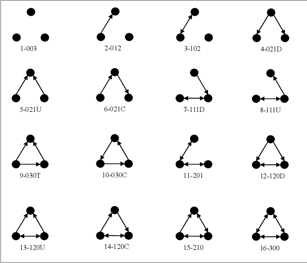
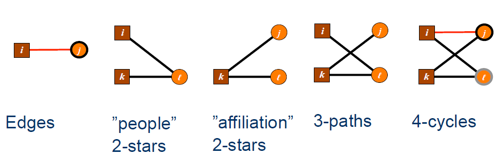
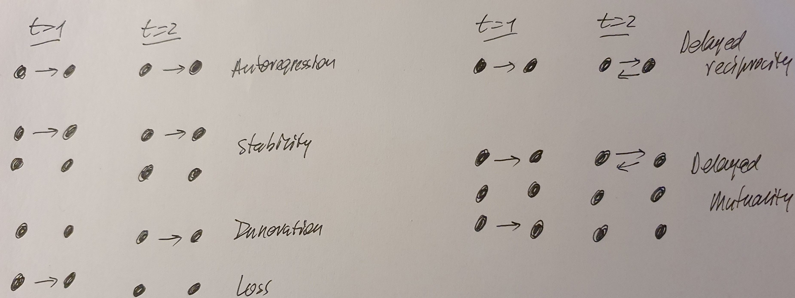
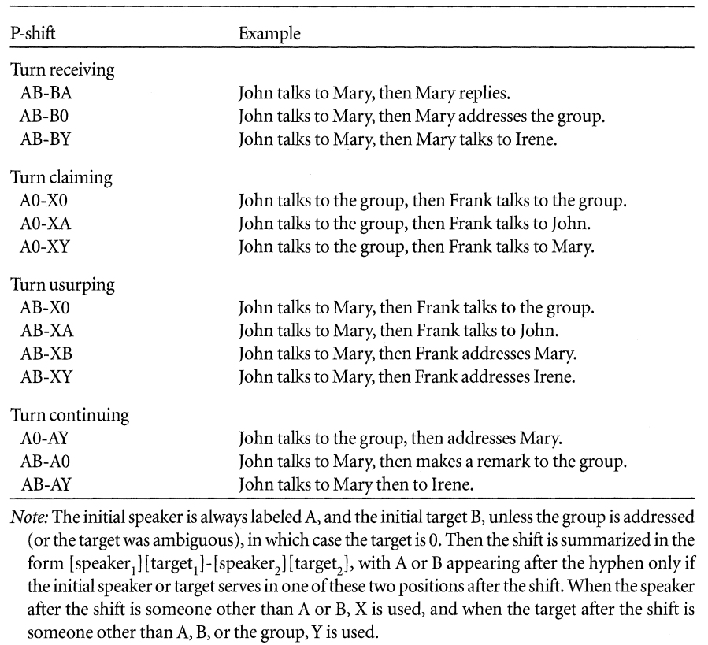

```{r setup, include=FALSE}
knitr::opts_chunk$set(
  collapse = TRUE,
  echo = FALSE,
  comment = "#>",
  eval = FALSE,
  echo = TRUE,
  message = FALSE, 
  warning = FALSE
)

```

```{r gt_tables, include = FALSE, eval = TRUE, file='create_tables.R'}
```

```{=html}
<style type="text/css">
.main-container {
  max-width: 1200px;
  margin-left: auto;
  margin-right: auto;
}
</style>
```
```{=html}
<style type="text/css">
pre {
    border-style: hidden;
}
</style>
```
<br><br> In this *cheatsheet* we summarize the main `R` functions that
are used in the SNA4DS course. We will not explain the underlying
concepts here, but refer you to the lectures, labs, and slides of the
course for that.

The aim of this cheatsheet is that it provides you with an overview of
the main functions you will need throughout the course. We hope that it
can provide a useful reference for you, as you develop and apply your
network analysis skills.

> NOTE:
>
> Most functions have multiple arguments. Our aim is in this cheatsheet
> not to show and discuss the various arguments that exist, because that
> would yield an unwieldy and very long document. Rather, we recommend
> you use your `R` skills and use the help function `?` and `help` and
> other approaches we teach you in this course to learn about the
> details of a specific function. If you still can't figure it out,
> contact us and we'll assist you.

<br><br>

# Main packages in the SNA4DS course {#main_packages}

## Overview of `igraph` and `network` graph objects

There are two main packages for basic graph generation and manipulation:
the `igraph` package and the `statnet` package. Actually, `statnet` is a
suite of packages that work together. In this course, we will will make
use of several packages from the `statnet` suite.

The `igraph` package creates a graph object of type `igraph`. The
`statnet` suite creates a graph object of type `network`. There are many
things you can do in both packages. Both packages can generate graphs
and do basic manipulation, so here you should just use the package whose
API you like best. The `igraph` package provides more mathematical
functions to apply to the graph data and the `statnet` suite provides
loads of statistical models that the `igraph` package does not do.

## The `snafun` package {#snafun-intro}

The `igraph` package and `statnet` suite are jointly very powerful and
can support much of your analyses of network data. However, as you read
above, they each require graph objects that have specific structures and
they can't deal with a graph object that has a different structure. So,
if you want to use the functions from both the `igraph` and the `sna`
packages, you need network data in `igraph` format (for the `igraph`
package), in `network` format (for the `network` package and some of the
`sna` package) and in `matrix` format (for many of the functions in the
`sna` package). In other words, you will have to convert your data
between these formats and you also have to deal with the differing API's
between these various packages.

Believe it or not, this is a pain and quite annoying.

**THE `snafun` PACKAGE TO THE RESCUE!**

The `snafun` package does three things:

-   First, it provides an (fairly) consistent API, so you don't have to
    constantly figure out what a specific argument means for each
    function;
-   Second, most of the functions in the `snafun` package work on both
    objects of class `igraph` or `network`. As a result, you can do what
    you want to do, without bothering with whether the object you work
    on is of class `igraph` or `network`.
-   Third, by removing the pain coming from the constant switching
    between the two groups of packages and their inconsistent API, you
    can now actually focus on the **fun** of network analysis, rather
    than the frustration.

Oh, and there is a *fourth advantage* too: the authors of the `snafun`
package are cool people. So, if you have the need for a new function in
the package, just get in touch with us and we'll see what we can do for
you.

<br>

# Creating a graph object {#generate}

This is how you create graph objects of class `igraph` or `network`.

```{r table_create, echo = FALSE, eval = TRUE}
table_create
```

<br>

## Additional graph creation functions

The `snafun` package offers a few functions that assist with the
manipulation of graph data in `R`.

-   `snafun::make_edgelist(names = NULL, attribute = NULL)`

The input is a data.frame (`names`) with edge information. The
`attribute` is a vector that contains a node attribute for those
vertices.

The function returns a vector or data.frame that can be read into
`igraph` or `network`.

-   `snafun::make_nodelist(names = NULL, attribute = NULL)`

The input is a data.frame (`names`) with edge information. The
`attribute` is another data.frame that contains the values of those
edges.

The function returns an edgelist that can be read into `igraph` or
`network`.

<br><br><br>

# Converting between graph classes

As mentioned [above](#snafun-intro), a common network analysis workflow
includes the conversion of graph objects between various formats. The
`igraph` and `statnet` packages provide some very basic functions for
this, that are specific to the types of objects that are used in these
packages themselves:

```{r table_convert, echo = FALSE, eval = TRUE}
table_convert
```

Conversion between various formats is a lot easier with the help of the
`snafun` package. You only need to know some very easy function names to
convert between the common graph classes. Here is an overview of which
function to use for which conversion:

```{r table_to, echo = FALSE, eval = TRUE}
table_to
```

# Manipulating the graph object {#manipulate}

Once you have a network object, you will want to explore it and access
parts of it or extract info from it.

Here is a table with some of the functions you'll use all the time in
any SNA project.

```{r table_manipulate, echo = FALSE, eval = TRUE}
table_manipulate
```

# Graph level indices

Below you will find a table to determine the foundational indices of a
graph at the graph-level.

```{r table_graph, echo = FALSE, eval = TRUE}
table_graph
```

## Communities and other subgroups

It is informative to know that the `snafun` functions to extract
communities yield results that can be scrutinized by `igraph`. The
`snafun` package is smart enough to do this, regardless of whether the
original input graph was of class `igraph` or `network`. Really handy.

Here's an example.

```{r walktrap, echo = TRUE, eval = TRUE}
# generate a random directed graph with 20 vertices and 30 edges
g <- snafun::create_random_graph(20, "gnm", m = 30)

# determine the walktrap communities
walk <- snafun::extract_comm_walktrap(g)
print(walk)

# get the modularity score
igraph::modularity(walk)

# who is member of which community
igraph::communities(walk)

# which community is a vertex member of
igraph::membership(walk)

# number of communities
length(walk)

# size of each community
igraph::sizes(walk)

# which edge connects multiple communities
igraph::crossing(walk, g)

# plot the network, highlighting the communities
plot(walk, g)
```

If you are so inclined, you can plot the community division as a
dendrogram, as follows:

```{r dendro, echo = TRUE, eval = TRUE}
snafun::plot_comm_dendrogram(walk)
```

# Vertex-level indices

Here are the functions to determine many of the vertex-level indices you
will want to use in this course.

```{r table_vertex, echo = FALSE, eval = TRUE}
table_vertices
```

# Dyad-level indices

Here are the functions for several of the dyad-level indices you will
want to use in this course.

```{r table_dyad, echo = FALSE, eval = TRUE}
table_dyads
```

<br><br><br>

# Plotting

## Basic plotting in `igraph`

The `plot` function alone already plots nodes and edges with default
options. More sophisticated specifications need to be manually set. It
works with networks of class `igraph`.

```{r, ehco = TRUE}
plot(net,
     edge.arrow.size = .2,                # edge and arrow size
     edge.color = "red",                  # edge color
     vertex.color = "blue",               # vertex filling color
     vertex.frame.color = "green",        # vertex perimeter color
     vertex.label = igraph::V(net)$label, # vertex labels
     vertex.label.cex = 0.6,              # vertex label size
     vertex.label.color = "black")        # vertex label color
```

## Basic plotting in `network`

The `gplot` function alone already plots nodes and edges with default
options. More sophisticated specifications need to be manually set. It
works with networks of class `network`.

```{r, echo = TRUE}
gplot(net,
      arrowhead.cex = 0.2,     # edge and arrow size
      edge.col = 'red',        # edge color
      vertex.col = 'blue',     # vertex filling color
      vertex.border = 'green', # vertex perimeter color
      displaylabels = TRUE,    # vertex labels
      label.cex = 0.6,         # vertex label size
      label.col = 'black')     # vertex label color
```

## Plotting in `snafun`

The `snafun` package contains a function to plot centrality scores of
the vertices. The function and its options are specified as follows:

```{r, echo = TRUE}
snafun::plot_centralities(
  net,
  measures = c("betweenness", "closeness", "degree", "eccentricity"),
  directed = TRUE,
  mode = c("all", "out", "in"),
  k = 3,
  rescaled = FALSE,
  ...
)
```

This yields a plot like this:

```{r plot_centralities, echo=FALSE, eval = TRUE}
knitr::include_graphics("plot_centralities.png")
```

The function takes an object of class `igraph` or `network` and plots
the centrality scores you select, so you can visually compare them. Make
sure to pick the required value for `mode` (the default is "all").

<br><br><br>

# Statistical models

## Overview table

Here is an overview of the statistical models discussed in the course.

<br>

```{r, echo = FALSE, eval = TRUE}
table_models
```

<br>

## Network autocorrelation models

The network autocorrelation model is run through the `sna::lnam`
function. The basic function call is as follows:

```{r}
sna::lnam(y, x = NULL, W1 = NULL, W2 = NULL)
```

Here,

-   `y` is a vector with a value for each vertex. The implementation in
    `sna::lnam` is only appropriate for continuous dependent variables.

-   `W` is a matrix of the same dimension as the network, containing the
    weights that drive the network influence process. You need to
    specify `W1` for the network effects model. Include weight matrix
    `W2` if you want to run a network disturbances model.

-   `x` is a matrix with a row per vertex. Make sure to include a column
    with 1's into `x`, so an intercept is included. Make sure to include
    column names as well, so you get informative output.

In `sna` there is a useful `summary` method (that shows you an overview
of the results) and a `plot` method (that you use to check model
assumptions).

<br>

## Conditional Uniform graphs (CUG)

There are two methods to perform a conditional Uniform graph test.

The first is to generate the graphs manually and calculate the measures
on each graph. Generation of these graphs can be done using
`snafun::create_random_graph` (which conditions on size and density).
The equivalent functions in `sna` are `sna::rgraph` and `sna::rgnm`
(note that these generate a matrix, rather than an `igraph` or `network`
graph). See [the data generation table](#generate) for these functions.

The second approach is to use a function that does the graph generation
and computes the network measure for you. The preferred is
`sna::cugtest`, which is specified as follows:

```{r}
sna::cug.test(g, FUN, mode = c("digraph", "graph"), cmode = c("size",
    "edges", "dyad.census"), reps = 1000,
    ignore.eval = TRUE, FUN.args = list())
```

See the `sna` help function for details.

Here

-   `FUN` is the function that needs to be calculated on each graph

-   `FUN.args` contains any arguments that are required for the function
    you specified in `FUN`

-   `cmode` determines the type of graphs that are drawn (ie. what you
    condition on). The options are

    -   "size": this generates graphs with a particular size and density
        0.5. You rarely want this.

    -   "edges": this conditions on a specific edge count (or an exact
        edge value distribution)

    -   "dyad.census": this conditions on a dyad census (or dyad value
        distribution)

For example, in order to test whether the transitivity in your graph `g`
is exceptional for a network of the same size and density as in `g`, you
would run

```{r}
sna::cug.test(g, sna::gtrans, cmode = "edges")
```

It is wise to always explicitly tell the function whether your graph is
directed or not, so a better way to specify the previous function is

```{r}
sna::cug.test(g, mode = "graph", FUN = sna::gtrans,
              cmode = "edges", reps = 1000,
              FUN.args = list(mode = "graph"))
```

Testing the betweenness centralization of you network `g` could be
performed as follows, again conditioning on size and density:

```{r}
sna::cug.test(g,
              sna::centralization,
              FUN.arg=list(FUN = sna::betweenness),
              mode="graph",
              cmode="edges")
```

There is also a useful `plot` method for the result of the CUG test.

<br>

## QAP test

There are two methods to perform a QAP test.

The first is to manually permute the graph. Generation of these graphs
can be done using `igraph::permute` or `sna::rmperm`. See [the data
generation table](#generate) for these functions.

The second approach is to use a function that does the graph permutation
and computes the required measure (typically a correlation) for you. The
preferred is `sna::qaptest`, which is specified as follows:

```{r}
sna::qaptest(g, FUN, reps = 1000, ...)
```

See the `sna` help function for details.

Here

-   `FUN` is the function that needs to be calculated after each
    permutation

-   `...` contains any arguments that are required for the function you
    specified in `FUN`

Typically, you want to test the correlation between two graphs, as
follows:

```{r}
sna::qaptest(list(firstNetwork, secondNetwork),
             FUN = sna::gcor, reps = 1000,
             g1 = 1, g2 = 2)
```

There is a useful `summary` method and a `plot` method for the output of
the function.

<br>

## QAP linear regression

QAP linear regression is performed through the `sna::netlm` function.
The function looks as follows:

```{r}
sna::netlm(y, x, intercept = TRUE, mode = "digraph",
    nullhyp = "qapspp", reps = 1000)
```

Make sure to always set `intercept = TRUE` and `nullhyp = "qapspp"`. For
small networks, 1000 replications should be enough, for larger networks
you should typically use a higher number (say, 2000).

As an example, this is how you specify a model where graph `g` is
modeled as a linear function of graphs `g1`, `g2`, and `g3`.

```{r}
mod <- sna::netlm(y = g, x = list(g1, g2, g3), intercept = TRUE,
                              nullhyp = 'qapspp', reps = 1001)
mod$names <- c("Intcpt", "Net1", "Net2", "Net3")
summary(mod)
```

It is wise to add the names of the networks to the output object, like
you see above. That is not strictly necessary, but it makes the output
of the function easier to read.

<br>

## QAP logistic regression

QAP logistic regression is performed through the `sna::netlogit`
function. The function looks as follows:

```{r}
sna::netlogit(y, x, intercept = TRUE, mode = "digraph",
    nullhyp = "qapspp", reps = 1000)
```

Make sure to always set `intercept = TRUE` and `nullhyp = "qapspp"`. For
small networks, 1000 replications should be enough, for larger networks
you should typically use a higher number (say, 2000).

As an example, this is how you specify a model where binary graph `g` is
modeled as a function of graphs `g1`, `g2`, and `g3`.

```{r netlogit1, exercise = TRUE}
mod <- sna::netlogit(g, list(g1, g2, g3),
                     intercept = TRUE,
                     nullhyp = "qapspp", reps = 1001)
mod$names <- c("Intcpt", "Net1", "Net2", "Net3")
summary(mod)
```

<br><br><br>

## Terms classification for every Exponential Random Graph Model (ERGM)

Terms can be classified in six main ways.

-   Dyadic independent and dyadic dependent terms: We encounter the
    first one when the probability of edge formation is related to nodes
    properties or attributes; we encounter the second when the
    probability of edge formation depends on other existing edges.

-   Structural and nodal attributes terms: The first kind provides tools
    to understand the structure of the network per se; the second kind
    provides tools to explain how nodal attributes might have influenced
    the formation of edges.

-   Terms for directed networks and terms for undirected networks

-   Exogenous and Endogenous terms: The first one refers to terms using
    covariates, the second to structural terms.

-   Markovian or non-Markovian: a Markovian term measures the structure
    in a network neighborhood

-   Curved (geometrically weighted ) or non-curved: terms that are
    tweaked to improve the model stability

## Binary Exponential Random Graph Model (ERGM)

An ERGM model is performed through the `ergm::ergm` function. The basic
function call is as follows:

```{r ergm }
fit <- ergm::ergm(formula)
```

The formula requires the specification of a network dependent variable,
and a list of terms.

### Most popular structural/endogenous - dyadic independent terms

-   `edges` Extent to which the number of edges in the network
    characterizes the overall structure (Is it a random number of edges,
    or it is the meaningful outcome of a certain phenomenon?).
    Introduces one statistic to the model. Directed and Undirected
    networks.

-   `density` Extent to which the network density characterizes the
    overall structure (Is it a random density, or it is the meaningful
    outcome of a certain phenomenon?). Introduces one statistic to the
    model. Directed and Undirected networks.

-   `sender` Extent to which a specific node, compared to a baseline
    one, is sending out non-random edges (different from the same node's
    behavior in a random distribution). Introduces to the model as many
    statistics as the number of nodes minus one. Directed Networks only.

-   `receiver` Extent to which a specific node, compared to a baseline
    one, is receiving non-random edges (different from the same node's
    behavior in a random distribution). Introduces to the model as many
    statistics as the number of nodes minus one. Directed Networks only.

### Most popular structural/endogenous/Markovian - dyadic dependent terms

-   `mutual` Extent to which ties are more likely to be reciprocated
    than they would be in a random network (controlling for the other
    effects). Introduces one statistic to the model. Directed networks
    only.

-   `asymmetric` Extent to which the observed non reciprocated ties are
    non-random. Introduces one statistic to the model. Directed networks
    only.

-   `triangles` Extent to which the observed triangles are non-random.
    Introduces one statistic to the model. Directed and Undirected
    networks. In the case of directed network measures "transitive
    triple" and "cyclic triple", so triangle equals to `ttriple` plus
    `ctriple`.

-   `triadcensus` Extent to which the sixteen categories in the
    categorization of Davis and Leinhardt (1972) are observed in the
    network and are not generated at random. Introduces 16 statistics to
    the model. Directed networks only.



-   `balance` Extent to which type 102 or 300 in the categorization of
    Davis and Leinhardt (1972) -balanced triads- observed in the network
    are non-random. Introduces one statistic to the model. Directed
    networks only.

-   `transitive` Extent to which type 120D, 030T, 120U, or 300 in the
    categorization of Davis and Leinhardt (1972) -transitive triads-
    observed in the network are non-random. Introduces one statistic to
    the model. Directed networks only.

-   `intransitive` Extent to which type 111D, 201, 111U, 021C, or 030C
    in the categorization of Davis and Leinhardt (1972) -intransitive
    triads- observed in the network are non-random. Introduces one
    statistic to the model. Directed networks only.

-   `degree(n)`, `idegree(n)`, `odegree(n)` Extent to which nodes with a
    specified degree are non random. Introduces one statistic to the
    model. Directed and Undirected networks, with the possibility of
    `in` and `out` specifications for Directed networks.

-   `kstar(n)`, `istar(n)`, `ostar(n)` Extent to which stars connecting
    the specified number of nodes are non random. Introduces one
    statistic to the model. Directed and Undirected networks, with the
    possibility of `in` and `out` specifications for Directed networks.

-   `cycle(n)` Extent to which cycles with a specified number of nodes
    are non-random. Introduces one statistic to the model. Directed and
    Undirected networks.

### Most popular structural/endogenous/curved - dyadic dependent terms

-   `gwesp(decay=0.25, fixed=FALSE)` Geometrically weighted edgewise
    shared partner distribution. It can be used in place of triangles to
    improve convergence. The decay parameter should be non-negative. The
    value supplied for this parameter may be fixed (if `fixed=TRUE`), or
    it may be used instead as the starting value for the estimation of
    decay in a curved exponential family model (when `fixed=FALSE`, the
    default) (see Hunter and Handcock, 2006). This term can be used with
    directed and undirected networks. For directed networks, only
    outgoing two-path (`“OTP”`) shared partners are counted.

-   `dgwesp(decay=0.25, fixed=FALSE, type= 'RTP')` Geometrically
    weighted edgewise shared partner distribution. It also counts other
    types of shared partners not covered by `gwesp`: Outgoing Two-path
    (`“OTP”`), Incoming Two-path (`“ITP”`), Reciprocated Two-path
    (`“RTP”`), Outgoing Shared Partner (`“OSP”`), Incoming Shared
    Partner (`“ISP”`).

-   `gwdegree(decay, fixed=FALSE, attr=NULL, cutoff=30, levels=NULL)`,
    `gwidegree(.5,fixed=T)`, `gwodegree(.5,fixed=T)` Geometrically
    weighted degree distribution. It can be used in place of `degree(n)`
    to improve convergence. Introduces one statistic to the model equal
    to the weighted degree distribution with decay controlled by the
    decay parameter. Directed and Undirected networks, with the
    possibility of `in` and `out` specifications for Directed networks.

### Most popular nodal covariate terms

-   `nodecov`, `nodeicov`, `nodeocov` Numeric or Integer attributes.
    Extent to which the attribute values influence edge formation (same
    as in a logit model) so that it is non-random under that condition.
    Introduces one statistic to the model. Directed and Undirected
    networks, with the possibility of `in` and `out` specifications for
    Directed networks. Dyadic independent.

-   `nodefactor`, `nodeifactor`, `nodeofactor` Categorical attributes.
    Extent to which nodes characterized by a specific category form more
    ties, so that tie formation is non-random under that condition.
    Introduces to the model a number of statistics equal to the number
    of categories minus one. Directed and Undirected networks, with the
    possibility of `in` and `out` specifications for Directed networks.
    Dyadic independent.

-   `absdiff` Numeric or Integer attributes. Extent to which common
    features measured in terms of distance similarity influence edge
    formation, so that edge formation is non-random under that
    condition. Introduces one statistic to the model. Directed and
    Undirected networks. Dyadic independent.

-   `nodematch` Categorical attributes. Extent to which nodes
    characterized by a specific category belonging to a certain
    attribute form ties with other node characterized by the same
    category, so that tie formation under that condition is non-random.
    Introduces to the model as many statistics as the number of
    categories. Directed and Undirected networks. Dyadic independent.
    ---Differential homophily

-   `edgecov` Matrix attribute. Extent to which the ties formed in
    another context influence tie formation in the context of the
    current model, so that tie formation under that circumstances is
    non-random. Introduces one statistic to the model. Directed and
    Undirected networks. Dyadic dependent.

-   `nodemix` Categorical attributes. Extent to which nodes denoted by
    different categories of an attribute form ties, so that tie
    formation under these circumstances is non-random. Introduces as
    many statistics as the number of combinations between every two
    categories. Directed and Undirected networks. Dyadic independent.

### Terms specifications

Use the argument `levels` within the term specification for selecting
the baseline or reference category.

Example: set female as a reference category.

```{r}
fit <- ergm::ergm(Net ~ edges + nodefactor('sex', levels = -(2)))
```

### Searching for terms

You can look for additional terms with

```{r}
search.ergmTerms(keyword, net, categories, name)
```

You have four arguments to help you finding terms:

-   `keyword` optional character keyword to search for in the text of
    the term descriptions. Only matching terms will be returned.
    Matching is case insensitive.

-   `net` a network object that the term would be applied to, used as
    template to determine directedness, bipartite, etc

-   `categories` optional character vector of category tags to use to
    restrict the results (i.e. 'curved', 'triad-related') --see
    categorization of terms in the manual

-   `name` optional character name of a specific term to return

### Checking your data before the analysis

Before you run any exponential random graph model you must know your
data by heart. Not only using descriptive network statistics, but also
checking model specifications, before hitting the run button.

-   Manually check the attribute(s) (numeric, integer, categorical,
    ordinal)

```{r}
table(snafun::extract_vertex_attribute(Net, 'sex'))
```

-   check mixing of categorical attributes

```{r}
snafun::make_mixingmatrix(Net, "sex")
```

-   check model statistics.

```{r}
summary(Net ~ edges + nodefactor('sex'))
```

This last one provides the number of observed cases under the
assumptions of each term.

### Reading results

You interpret ERGM results as logit models results. Two options:

-   Compute odd ratios for each coefficient

```{r}
OR <- exp(coef)
```

-   Compute probability for each coefficient

```{r}
P <- exp(coef) / (1 + exp(coef))
```

-   Compute odd ratios using the `SNA4DS` function

```{r}

OR <- snafun::stat_ef_int(m)

```

-   Compute probability using the `snafun` function

```{r}

P <- snafun::stat_ef_int(m, type = "probs")

```

### Simulating networks

It is sometimes helpful to simulate networks with the same features at
the one you observed in real life.

-   Simulating a network from a model

```{r}
fit <- ergm::ergm(Net ~ edges)
simfit <- simulate(fit, burnin = 1e+6, verbose = TRUE, seed = 9)
```

-   simulate network fixing the coefficient results

```{r}

RandomNet <- network::network(16,density=0.1,directed=FALSE)

sim <- simulate(~ edges + kstar(2), nsim = 2, coef = c(-1.8, 0.03),
                  basis = RandomNet,
                  control = ergm::control.simulate(
                    MCMC.burnin=1000,
                    MCMC.interval=100))
sim[[1]]
```

### MCMC Diagostics

You can check the Monte Carlo Markov Chains diagnostic for your dyadic
dependent model using the function:

```{r}
ergm::mcmc.diagnostics(fit)
```

### Goodness of Fit

You can check the goodness of fit of your model using the function

```{r}
ergm::gof(fit)
```

You can also plot your `gof` output

```{r}
plot(ergm::gof(fit))
```

or, making use of your new best friend (the `snafun` package):

```{r}
snafun::stat_plot_gof(fit)
stat_plot_gof_as_btergm(fit)
```

<br><br><br>

## Bipartite ERGMs

A bipartite ERGM works exactly the same way as a binary one. However, in
order to make it handle data differentiating between two partitions, it
is necessary to use some specially defined terms. Moreover, you will
need to specify the model with more advanced settings since it is
computationally more demanding.

### Importing Bipartite ERGMs

Since you are using the same function as binary ERGM (`ergm::ergm`) to
run the model, it is necessary to make sure that the software knows that
it needs to handle a bipartite structure.

#### Step one: Specify the incidence matrix

The data that contains bipartite network information needs to be
specified into a partition 1 X partition 2 data frame or matrix.

If 10 people attend 4 events, the incidence matrix will have dimensions
10 X 4.

#### Step two: Import the network as a bipartite

You can import the network as bipartite using these specifications.

```{r}

BipNet <- network::network(BipData, directed = FALSE, bipartite = TRUE)

```

#### Step three: Import the attributes

You can import the attributes using this code. The attribute vector
needs to contain as many elements as Partition 1 + Partition 2. However,
it is unlikely to have an attribute that makes sense for both partitions
at the same time.

Make sure to insert the information that concerns partition 1 and
afterward the information that concerns partition 2.

Make sure to code as `NA` the entry for the partition for which you do
not have information.

For instance, if we have one attribute for partition one in a network
with 10 nodes in partition 1 and 4 in partition 2, we will have the
first ten digits storing information about nodes in partition 1 and 4
NAs for partition 2.

```{r}

# vertex.names <- vector of names
attrib1 <- as.character(c(0, 0, 0, 0, 0, 1, 1, 1, 1, 1, NA, NA, NA, NA))

snafun::add_vertex_attributes(BipNet, "vertex.names",  vertex.names)
snafun::add_vertex_attributes(BipNet, "attrib1",  attrib1)

```

#### Step four: Bipartite extra info

In order to make sure that the software correctly reads your bipartite
network, you need to code an extra attribute.

The attribute focuses on partition one. For example, if we have 10 nodes
in partition 1 we will use:

```{r}

snafun::add_vertex_attributes(BipNet, "bipratite", value = rep(10, 10), v = 1:10)

```

Note: `bipratite`, yes, it is a typo, but a typo in the package. Hence
make sure you misspell it; otherwise, you will get an error. (FUN FACT!)

### Terms for Bipartite ERGMs

Bipartite ERGMs terms are provided at the same time for both partitions
since it is relevant to consider the same structure from both
perspectives.



You can find the full list of bipartite terms by running:

```{r}

ergm::search.ergmTerms(categories = "bipartite")

```

They are 32 in total, so it is manageable.

#### The most popular terms are:

-   `b1star(k)` & `b2star(k)` -- `star(k)` for binary ERGMs

-   `gwb1dsp()` & `gwb2dsp()` -- same as `gwdsp()` for binary ERGMs

-   `b1cov` & `b2cov` -- same as `nodecov()` for binary ERGMs

-   `b1factor` & `b2factor` -- same as `nodefactor()` for binary ERGMs

-   `b1nodematch` & `b2nodematch` -- same as `nodematch()` for binary
    ERGMs

### Specifying advanced options

Since a bipartite ERGM is computationally more demanding than a regular
one, you need to make sure you specify the advanced options offered by
the `ergm` package.

#### Constraints

Constraints are options that allow you to set limits your simulation
takes into account

For instance, you can limit the simulation setting a min and a max
degree.

`constraints= ~ bd(minout = 0, maxout = 7)`

For instance,

```{r}
m <- ergm::ergm(BipNet ~ edges  + b1factor("attr1", levels = -1) + b1star(2),
                 constraints= ~ bd(minout = 0, maxout = 7))
```

There are many other constraints that it is possible to use

#### Control

Controls are options that allow you to be aware of what your simulation
is doing to a larger extent and, for this reason, to make it faster.

There are several options. For instance,

-   `MCMC.burnin` - ignore than many chains before starting to estimate
    parameters

-   `MCMC.samplesize` - collect that number of information from the
    previous state in order to inform the following one

-   `seed` - makes the simulation go the same way every time it is run

-   `MCMLE.maxit` - breaks the algorithm after that number of attempts.

For instance,

```{r}
m <- ergm::ergm(BipNet ~ edges  + b1factor("attr1", levels = -1) + b1star(2),
                 constraints= ~ bd(minout = 0, maxout = 7),
                 control = ergm::control.ergm(MCMC.burnin = 5000,
                                              MCMC.samplesize = 10000,
                                              seed = 1234,
                                              MCMLE.maxit = 20))
```

<br><br><br>

## Weighted ERGMs

A weighted network is a network where the edges express the weight or
the intensity of the relationship.

It is still unimodal, but it contains more information.

In order to use weighted ergms, the network needs to be fully connected.

Different kinds of weights require different models. You need to check:

-   what kind of variable type characterizes your weights (integer,
    count, numeric, ordinal...)
-   what kind of distribution does your weight have

The `GERGM` package works with fully connected networks and
(theoretically ) every kind of weight variable.

The `GERGM` package does not recognize either the `network` or the
`igraph` classes.

You need to work with weighted adjacency matrices (NxN - squared, that
has inside the weight, rather than 0s and 1s).

### Documentation

Installation:

`remotes::install_github("matthewjdenny/GERGM", dependencies = TRUE)`

User manual

`https://github.com/matthewjdenny/GERGM`

Vignette

Run `browseVignettes("GERGM")`in the R console

### Most popular endogenous terms (Markovian and Curved)

-   `twostars`, equivalent to `star(2)` in `ergm`

-   `out2stars`, equivalent to `ostar(2)` in `ergm`

-   `in2stars`, equivalent to `istar(2)` in `ergm`

-   `ctriads`, same as in `ergm`

-   `mutual`, same as in `ergm`

-   `ttriads`, same as in `ergm`

Convergence problems? Use exponential down-weighting. AKA "curve" the
terms:

E.g., `out2stars(alpha = 0.25)` - default = 1

### Most popular exgenous terms

-   `absdiff(covariate = "MyCov")`

-   `sender(covariate = "MyCov")` -- different from `ergm`, here you can
    insert an attribute

-   `receiver(covariate = "MyCov")` -- different from `ergm`, here you
    can insert an attribute

-   `nodematch(covariate = "MyCov", base = "Ref.cat")`

-   `nodemix(covariate = "MyCov", base = "Ref.cat")`

-   `netcov(network)` -- like `edgecov` in `ergm`

### Running the model

First, we specify the formula,

```{r}
formula <- adjacencyMatrix ~ edges +
  sender("myCov") +
  receiver("myCov") +
  netcov(otherAdjMat) +
  mutual(alpha = .9)
```

Then we run the model

```{r}

set.seed(5)
gergmResults <- GERGM::gergm(formula,
                      estimation_method = "Metropolis", # chose the algorithm to estimate the model
                      covariate_data = covariateData, # passing attributes on
                      number_of_networks_to_simulate = 100000, # same as ergm
                      MCMC_burnin = 10000, # same as ergm
                      thin = 1/10, # retaining only a small number of simulated Networks in the computer memory
                      transformation_type = "Cauchy") # distribution of the weight

```

The `GERGM::gergm` function automatically prints results while it runs.
However, it is also possible to print them again separately.

#### Plotting MCMC diagnostics

`GERGM::Trace_Plot(gergmResults)`

#### Plotting the Goodnes of fit

`GOF(gergmResults)`

#### Plotting the results

`GERGM::Estimate_Plot(gergmResults)`

#### Printing a table with standard errors and coefficients

```{r}
(EstSE <- rbind(t(attributes(gergmResults)$theta.coef),
                t(attributes(gergmResults)$lambda.coef)))
```

#### Significance

`GERGM` models use confidence intervals instead of p-values.

You can estimate the confidence interval using this formula

```{r}
lower = coef - SE*(-qnorm((1 - 0.95)/2))
upper = coef + SE*(-qnorm((1 - 0.95)/2))
```

If the lower and the upper intervals are both negative or both positive,
the coefficient is significant.

If the lower and the upper intervals have different sign, the
coefficient is not significant.

<br><br><br>

## ERGM for temporal networks

The TERGM (=Temporal ERGM) can be used to model a sequence of **binary**
networks. The model is very similar to the ERGM, but the dependent
variable is now a list of networks: the first element is the network at
time 1, the second element is the network at time 2, et cetera.

### How to store the data for a TERGM

You store the data needed for fitting a TERGM as follows.

```{r tergms_24, echo = FALSE, eval = TRUE}
df <- as.data.frame(matrix(ncol = 2, nrow = 3))
df[1,] <- c("Time-varying dyadic covariates", "Either as a list of networks or matrices")
df[2,] <- c("Constant dyadic covariates", "Single network or matrix")
df[3,] <- c("Vertex level attributes", "As vertex attributes inside the observed network objects")

colnames(df) <- c("What", "How to store")
knitr::kable(df)
```

<br><br>

### How to fit a TERGM

You fit a TERGM with the `btergm` package (to be installed from CRAN).
This fits the model with MPLE, using bootstrapping to derive the
standard errors.

The `btergm` package is compatible with the `ergm` package and you can
use the terms from that package inside `btergm`.

There are three groups of temporal measures you can specify: `memory`,
`delayed reciprocity`, and `time covariates`.

<br><br><br>

```{r, echo = FALSE, eval = TRUE}
table_btergm_terms
```

<br>Visually:



<br>When a `timecov` is specified without including the value for the 
`transform`, the specification defaults to a linear trend over time. For
example: `timecov()` (= the effect of time per se) or
`timecov(militaryDisputes)` (= a linearly increasing or decreasing
effect of `militaryDisputes` over time).

### Parallel processing

The `btergm` package uses MPLE and that lends itself well to parallel
processing. You specificy that you want to use parallel processing using
the argument `parallel`.

Windows users can only use `parallel = "snow"`. Other systems can use
either `parallel = "snow"` or `parallel = "multicore"`. The latter is
probably often the better choice for non-Windows machines. Both options
require that you have the `parallel` package installed.

If you use the `parallel` option, you should also specify the
appropriate number of cores you want to use. Either set `ncpus = 4` (for
four cores) or use `ncpus = parallel::detectCores()` to have R recognize
the number of cores automatically (this usually works well, but not
always). The `ncpus` argument is ignored if you do not specify the
`parallel` argument.

The default is no parallel processing.

### Goodness-of-fit

Goodness of fit is determined by

`gof_m <- btergm:::gof.btergm(m, statistics = btergm_statistics)`, where

`m` is a fitted `btergm` model and `btergm_statistics` is a vector with
statistics to be included in the GoF. The default is

`c(btergm::dsp,`btergm::`esp,`btergm::`deg,`btergm::`ideg,`btergm::`geodesic,`btergm::`rocpr,`btergm::`walktrap.modularity)`.

Of course, the more statistics you include (and the more complex the
statistics), the more time it will take for the GoF calculations to
finish.

Use `` ?btergm:::`gof,btergm-method` `` for more options.

The GoF object can be plotted using `btergm:::plot.gof(gof_m)`.
More convenient is to use the helper function from the `snafun` package.
This is:

`gof_m <- snafun::stat_plot_gof_as_btergm(m)`

By default, this includes the statistics
`c(btergm::esp, btergm::geodesic, btergm::deg, btergm::rocpr)` in the
goodness-of-fit, but you can specify other statistics if you prefer. The
function returns the goodness-of-fit (in this case, in the `gof_m`
object) and plots it as well. This prevents you from having to use the
triple colon `:::` for `btergm:::gof.btergm` and is generally more
convenient. If you need the full flexibility of the
`btergm:::gof.btergm` function, use that directly. The results between
the two functions are identical.

If you include the `btergm::rocpr` "statistic" in your GoF, the
[red]{style="color:red;"} line is the Receiver Operating Characteristic
(ROC) curve and the [blue]{style="color:blue;"} line is the
Precision-Recall curve.

If you see value in the ROC or PR, you can find the arreas under the
curves using `` gof_m$`Tie prediction`$auc.roc `` and
`` gof_m$`Tie prediction`$auc.pr ``. Note that Precision-Recall is most
appropriate for sparse networks, while ROC works well for more connected
networks. Either way, the plots for the network statistics are generally
much more informative compared to ROC and PR (because the ROC and PR)
don't take the dependency structure in your data into account.

In the other plots, the grey boxplots represent the distribution of the
values from the observed networks, the thick black line is the median of
the simulations and the dashed line is the mean of the simulations. You
can suppress the median by plotting using:

`plot(gof_m, median = FALSE)`

Note: you can also feed a fitted ERGM model to

`snafun::snafun::stat_plot_gof_as_btergm(m)` 

and determine the goodness-of-fit for the fitted ERGM that way.

# Temporal networks (exploration and description)

The main packages to use in this course for descriptive and exploratory
analysis of temporal networks are `networkDynamic` to construct and
manipulate temporal networks), `tsna` (for `sna`-like network measures),
and `ndtv` (for visualization).

Edges will typically have a starting time (`onset`), and end time
(`terminus`), a duration, a sender (`tail`), and a receiver (`head`). of
course, edges can start and end multiple times during the observation
period and can have durations of length 0 up until any positive number.

The temporal networks are of class `networkDynamic`.

## Network generation and manipulation

-   `networkDynamic::networkDynamic`: construction of a temporal
    network. There are many ways in which you can construct a temporal
    network. A common way is to first construct a network that has the
    vertex names, any vertex static attributes, edge attributes, whether
    the network is directed, et cetera. <br> This network is called
    `base.net` and is used by this function to extract the basic aspects
    of the network. Don't worry that some values (e.g., vertex
    attributes) may change over time, because any temporal info you add
    to this function will override what is in `base.net`. But `base.net`
    is an excellent and efficient way to provide much data to the
    function about the temporal network and it more cumbersome to add
    that later on. <br> Further, you can provide dynamic data through
    `data.frame`s for vertices and for edges in several ways. Consult
    the `help` function for the details, as this vignette would become
    far too long otherwise.
-   `as.data.frame(g)` Extract the dynamic edge info from the network,
    as a `data.frame`.

Most of the functions below allow you to specify a time segment you are
interested in. Typically, these include `onset`, `terminus`, `length`,
and `at`. Below, we give only one example of how each function can be
specified.

-   `networkDynamic::list.vertex.attributes.active(g, onset = 5, terminus = 8)`
    List the attributes of the vertices that are active in a specific
    time segment.

-   `networkDynamic::get.vertex.attribute.active(g, "attrName", at = 1)`
    The value for vertex attribute `attrName` in a specific time
    segment.

-   `networkDynamic::list.edge.attributes.active(g, onset = 0, terminus = 49)`
    List the attributes of the edge that are active in a specific time
    segment.

-   `networkDynamic::get.edge.attribute.active(g, "attrName", at = 1)`
    The value for edge attribute `attrName` in a specific time segment.

-   `networkDynamic::network.extract(classroom, onset = 0, terminus = 1)`
    Extract the part of the temporal network for a specific time
    segment.

-   `networkDynamic::network.collapse(classroom, onset = 0, terminus = 1)`
    Collapse the temporal network into a static network based on the
    activity within a specific time segment.

-   `networkDynamic::activate.vertex.attribute`,
    `networkDynamic::activate.edge.attribute`, `activate.edge.value`,
    `activate.network.attribute` Set or modify attributes within a
    specific time segment.

-   `deactivate.vertex.attribute`, `deactivate.edge.attribute`,
    `deactivate.network.attribute` Make an attribute inactive during a
    specific time segment.

NOTE: The functions above for accessing and setting the attributes of a
`networkDynamic` object are not very user friendly. Luckily, you can
also access and/or set attributes using the `network` package or
the `snafun` package like in
the [network manipulation
table](#manipulate}). As long as you want to
access and/or set attributes that are *static*, this works much easier
and uses functions that you have used multiple times already in this
course and should be second nature to you by now.

## Network measures and descriptives

-   `networkDynamic::duration.matrix(g, changes, start, end)` This
    function takes a given temporal network `g`, a matrix with columns
    "time", "tail", "head" (this matrix is called a *toggle list*), and
    a start and end time. It returns a `data.frame` a list of edges and
    activity spells. A toggle represents a switch from active state to
    inactive, or vice-versa.

-   `network.size(g, onset = 5, length = 10)`. The size of a network
    during a specific time segment.

The following functions provide useful descriptives of durations in the
temporal network.

-   `tsna::edgeDuration(g, mode = "duration")` or
    `tsna::edgeDuration(g, mode = "counts")` Sums the activity duration
    or number of edge events in a time segment.

-   `tsna::vertexDuration(g, mode = "duration")` or
    `tsna::vertexDuration(g, mode = "counts")` Sums the activity
    duration or number of vertex events in a time segment.

-   `tsna::tiedDuration(g, mode = "duration")` Measures the total amount
    of time each vertex has ties.

-   `tsna::tiesDuration(g, mode = "counts")` Computes the total number
    of edge spells each vertex is tied by.

The functions `tsna::tEdgeFormation` and `tsna::tEdgeDissolution`
compute the number of edges forming or dissolving at time points over a
time segment. If `result.type = 'fraction'` the fraction of the number
of edges formed (or dissolved) is computed.

-   `tsna::tEdgeFormation(g, start = 1, end = 4, time.interval = 1)`

    Counts at times 1, 2, 3, and 4.

-   `tsna::tEdgeDissolution(g, start = 1, end = 4, time.interval = 1)`

    Counts at times 1, 2, 3, and 4.

### Calculating measures from `sna` over time

You can calculate any measure from the `sna` package on a collapsed time
segment or a series of collapsed time segments through the
`tsna::tSnaStats` function. These measures can be vertex level
statistics (e.g., `sna:betweenness`) or graph-level measures (e.g.,
`sna::grecip`). You specify which function you want to calculate and the
time segments they should be calculated on. The function returns a time
series, which makes the outcomes easy to plot.<br> For example, you want
to calculate transitivity of intervals that are 5 time points wide. The
following function calculates transitivity for time intervals \[0-5),
\[5-10), \[10-15), etc:

`tsna::tSnaStats(g, snafun = "gtrans", time.interval = 5, aggregate.dur = 5)`

This can cause some sudden shifts of values, so it is often more
informative to use overlapping segments. So, let us calculate density
for windows of width 0, at intervals of 3. This calculates density for
intervals 0-10, 3-13, 6-16, et cetera:

`tsna::tSnaStats(g, snafun = "gden", time.interval = 3, aggregate.dur = 10)`

### Calculating `ergm` terms over time

The `tsna` also allows you to compute `ergm` terms for specific time
segments. Because the model terms provided by the `ergm` package (and
its various add-ons) are 'change statistics' (that determine the effect
of changing a single tie on the overall network structure), you can use
these terms to describe the network within specific time segments. You
specify which terms you want to calculate using a formula.

For example,

`tsna::tErgmStats(g,'~edges + degree(c(1, 2))', start = 3, end = 10)`

calculates the number of edges (*edges*) and the values for *degree(1)*
and *degree(2* for each specified time segment. The output is a time
series (with a column for each statistic) and can simply be plotted
using `plot`. This plots the time series for each term above the others,
so you can see how all of them develop over time.

```{r, echo = TRUE, eval = TRUE}
data(windsurfers, package = "networkDynamic")

plot(tsna::tErgmStats(windsurfers,'~edges + degree(2) + kstar(3)',
                      aggregate.dur = 5), main = "ERGM terms over time")
```

In the lecture, we discussed *participation shifts*--also known as
*p-shifts*. Gibson (2003) defined 13 P-shifts, and the
`tsna::pShiftCount` function can count how often each type occurs in a
specific time segment. This is how Gibson describes each of the thirteen
types:

```{r, eval = TRUE}

```

### Participation shifts

-   `tsna::pShiftCount(g, start = 1, end = 3)` Calculates the number of
    times each of the above P-shifts occurred during the specified time
    segment. In other words, this calculates the *P-shift census*.

### Temporal paths

The `tsna::tPath` function calculates the set of temporally reachable
vertices from a given source vertex starting at a specific time.

-   `tsna::tPath(g, v = 12, direction = "fwd", start = 0, end = 3)` This
    calculates the temporal paths from vertex 12 to all other vertices,
    from the start of the specified time segment. When
    `direction = "bkwd"`, it determines the paths *to* vertex 12. You
    can further specify whether you will find the paths that arrive the
    first or the ones that leave the vertex at the latest possible
    times.

The generally most relevant parts of the resulting object are:

-   `tdist` The time each specific path takes. When a path does not
    exist, the value if Inf.

-   `gsteps` The length of the path (in terms of the number of steps).
    When a path does not exist, the value if Inf.

The `tsna::plotPaths` plots the network and highlights the calculated
temporal paths from the chosen vertex (vertex 12, in the example above).
It can also add a label to each edge, so you can see how much time it
takes for that edge to be activated from this focal vertex. You can
tweak the plot like you would tweak any network plot of class `network`.

```{r, echo = TRUE}
tsna::plotPaths(
  g,
  paths = tsna::tPath(g, v = 12, direction = "fwd", start = 0, end = 3),
  displaylabels = FALSE,        # remove the vertex labels, to prevent too much visual clutter
  vertex.col = "white",
  edge.label.cex = 1.5          # the color of the printed times
)
```

A related concept is that of "temporal reachability." The `tsna::tReach`
function computes, for each vertex, the number of vertices that are
temporally reachable over the entire observation period.<\br>
If you want to compute this for a specific time segment, first use
`networkDynamic::network.extract` to extract the segment of interest and
then feed this to the `tsna::tReach` function.

-   `tsna::tReach(g, direction = "fwd", start = 10, end = 20)` The
    function to calculate the temporal reachable sets using only
    temporally forward steps (you can also specify `direction = "bkwd"`
    to determine by how many vertices each vertex can be temporally
    reached).

## Network visualization

Temporal networks can be visualized in two ways. First, static plots can
be made of a temporal network, either by collapsing the temporal network
into a static network (or to break up the temporal network into static
networks of specific time segments).

### Visualizing as static networks

An obvious way to visualize the entire temporal network as a static
network is to simply use `plot(g)`.

Alternatively, the temporal network can be collapsed into smaller time
segments and plot these the network slices as static representations.

There are two functions that can do this. The `ndtv` package has the

`ndtv::filmstrip` that does this as follows:

-   `ndtv::filmstrip(g, frames = 9)` This plots the network at 9 points
    in time. It does *not* provide an overview of how the network
    changes over time, but it provides a series of snapshots (9, in this
    example) of the network. If the timing of the edges is in continuous
    time, this function has the tendency to plot nearly empty graphs, as
    it evaluates the networks at specific time *points*, rather than
    time *intervals*.

The `snafun` package implements a function that divides the specified
time period into time segments of equal time length and plots each
segment as a static network. This is useful to see how the network
changes over time. It also works nicely for networks where changes
happen in continuous time.

```{r}
snafun::plot_network_slices(9, number = 93)
```

A sometimes useful function is `ndtv::proximity.timeline`, which shows
the distance between the edges over time. The main purpose is to see how
the edges move vis-a-vis each other over time (based on the geodesic
path distance) and it often helps to see where and when subgroups are
forming over time.

The function call is:

```{r}
ndtv::proximity.timeline(g,  start = 10, end = 50,
                         time.increment = .5,
                         mode = 'isoMDS')
```

where you can change the *mode* to a different scaling algorithm. For
actual research projects, you want to try various settings and check
which gives you the most informative output for the data at hand.

The function allows you to set many arguments (such as labels and
colors).

### Visualizing as a dynamic network animation

The `ndtv` package includes functions to create an animation of how the
network unfolds over time. There are many arguments you can tweak, so
here we only focus on the main approach. Make sure to consult the
package help for more details.

There are two steps in creating a dynamic visualization in `ndtv`: you
first run `ndtv::compute.animation`, which determines coordinates and
other aspects of the dynamic plot. Second, you run
`ndtv::render.d3movie`, which, you guessed it, renders the actual
movie.<br>

```{r compute, exercise = TRUE, exercise.lines = 21}
# step 0: unfortunately, we have to load the package into our session
library(ndtv)

# step 1: compute the settings
ndtv::compute.animation(g, animation.mode = "kamadakawai",
                        slice.par = list(start = 0, end = 45,
                                         aggregate.dur = 1,
                                         interval = 1, rule = "any"))

# step 2, render the animation
ndtv::render.d3movie(g, usearrows = TRUE, displaylabels = FALSE ,
                     bg = "#111111",
                     edge.col = "#55555599",
                     render.par = list(tween.frames = 15,
                                       show.time = TRUE),
                     d3.options = list(animationDuration = 1000,
                                       playControls = TRUE,
                                       durationControl = TRUE),
                     output.mode = 'htmlWidget'
                     )
```

Some important arguments for `ndtv::render.d3movie` include:

-   `launchBrowser`: defaults to TRUE: determines whether the animation
    will be shown in the Browser after rendering.

-   `output.mode`: the kind of output you want (defaults to 'HTML')

-   `filename`: The file name of the HTML or JSON file to be generated.
    Only relevant if you picked 'HTML' or 'JSON' as output.mode.

Further, you can set most of the common graphical parameters, such as
`vertex.col`, `label.cex`, `use.arrows`, `edge.lwd`, et cetera.

If you want to fix vertices to the same location throughout the
animation, you do this as follows

```{r}
# use some way to determine a matrix of vertex locations
coords <- ndtv::network.layout.animate.kamadakawai(g)

# add the x and y coordinates as vertex attributes
# adapt onset and terminus if required
networkDynamic::activate.vertex.attribute(g, "x", coords[, 1],
                                          onset = -Inf, terminus = Inf)

networkDynamic::activate.vertex.attribute(g, "y", coords[, 2],
                                          onset = -Inf, terminus = Inf)

# compute the new animation settings
# We now use `animation.mode = "useAttribute"`
ndtv::compute.animation(g, animation.mode = "useAttribute",
                        slice.par = list(start = 0, end = 45,
                                         aggregate.dur = 1,
                                         interval = 1, rule = "any"))
```

<br><br><br>
