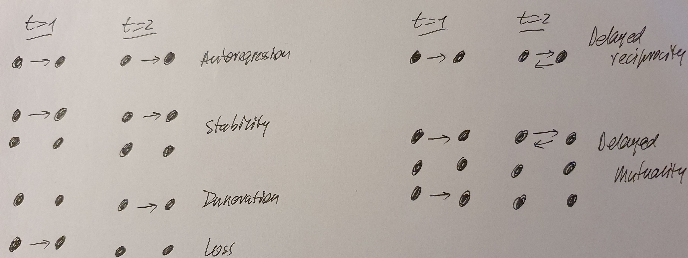

```{r, include = FALSE}
knitr::opts_chunk$set(
  collapse = TRUE,
  comment = "#>"
)
```


```{r setup, include=FALSE}
knitr::opts_chunk$set(
  collapse = TRUE,
  echo = FALSE,
  comment = "#>",
  eval = FALSE,
  echo = TRUE,
  message = FALSE, 
  warning = FALSE
)

```

```{r gt_tables, include = FALSE, eval = TRUE, file='create_tables.R'}
```

```{=html}
<style type="text/css">
.main-container {
  max-width: 1200px;
  margin-left: auto;
  margin-right: auto;
}
</style>
```
```{=html}
<style type="text/css">
pre {
    border-style: hidden;
}
</style>
```


# ERGM for temporal networks

The TERGM (=Temporal ERGM) can be used to model a sequence of **binary**
networks. The model is very similar to the ERGM, but the dependent
variable is now a list of networks: the first element is the network at
time 1, the second element is the network at time 2, et cetera.

## How to store the data for a TERGM

You store the data needed for fitting a TERGM as follows.

```{r tergms_24, echo = FALSE, eval = TRUE}
df <- as.data.frame(matrix(ncol = 2, nrow = 3))
df[1,] <- c("Time-varying dyadic covariates", "Either as a list of networks or matrices")
df[2,] <- c("Constant dyadic covariates", "Single network or matrix")
df[3,] <- c("Vertex level attributes", "As vertex attributes inside the observed network objects")

colnames(df) <- c("What", "How to store")
knitr::kable(df)
```

<br><br>

## How to fit a TERGM

You fit a TERGM with the `btergm` package (to be installed from CRAN).
This fits the model with MPLE, using bootstrapping to derive the
standard errors.

The `btergm` package is compatible with the `ergm` package and you can
use the terms from that package inside `btergm`.

There are three groups of temporal measures you can specify: `memory`,
`delayed reciprocity`, and `time covariates`.

<br><br><br>

```{r, echo = FALSE, eval = TRUE}
table_btergm_terms
```

<br>Visually:



<br>When a `timecov` is specified without including the value for the
`transform`, the specification defaults to a linear trend over time. For
example: `timecov()` (= the effect of time per se) or
`timecov(militaryDisputes)` (= a linearly increasing or decreasing
effect of `militaryDisputes` over time).

## Parallel processing

The `btergm` package uses MPLE and that lends itself well to parallel
processing. You specificy that you want to use parallel processing using
the argument `parallel`.

Windows users can only use `parallel = "snow"`. Other systems can use
either `parallel = "snow"` or `parallel = "multicore"`. The latter is
probably often the better choice for non-Windows machines. Both options
require that you have the `parallel` package installed.

If you use the `parallel` option, you should also specify the
appropriate number of cores you want to use. Either set `ncpus = 4` (for
four cores) or use `ncpus = parallel::detectCores()` to have R recognize
the number of cores automatically (this usually works well, but not
always). The `ncpus` argument is ignored if you do not specify the
`parallel` argument.

The default is no parallel processing.

## Goodness-of-fit

Goodness of fit is determined by

`gof_m <- btergm:::gof.btergm(m, statistics = btergm_statistics)`, where

`m` is a fitted `btergm` model and `btergm_statistics` is a vector with
statistics to be included in the GoF. The default is

`c(btergm::dsp,`btergm::`esp,`btergm::`deg,`btergm::`ideg,`btergm::`geodesic,`btergm::`rocpr,`btergm::`walktrap.modularity)`.

Of course, the more statistics you include (and the more complex the
statistics), the more time it will take for the GoF calculations to
finish.

Use `` ?btergm:::`gof,btergm-method` `` for more options.

The GoF object can be plotted using `btergm:::plot.gof(gof_m)` or, often
more usefully, through `snafun::stat_plot_gof(gof_m)`. More convenient
is to use the helper function from the `snafun` package. This is:

`gof_m <- snafun::stat_plot_gof_as_btergm(m)`

By default, this includes the statistics
`c(btergm::esp, btergm::geodesic, btergm::deg, btergm::rocpr)` in the
goodness-of-fit, but you can specify other statistics if you prefer. The
function returns the goodness-of-fit (in this case, in the `gof_m`
object) and plots it as well. This prevents you from having to use the
triple colon `:::` for `btergm:::gof.btergm` and is generally more
convenient. If you need the full flexibility of the
`btergm:::gof.btergm` function, use that directly. The results between
the two functions are identical.

If you include the `btergm::rocpr` "statistic" in your GoF, the
[red]{style="color:red;"} line is the Receiver Operating Characteristic
(ROC) curve and the [blue]{style="color:blue;"} line is the
Precision-Recall curve.

If you see value in the ROC or PR, you can find the arreas under the
curves using `` gof_m$`Tie prediction`$auc.roc `` and
`` gof_m$`Tie prediction`$auc.pr ``. Note that Precision-Recall is most
appropriate for sparse networks, while ROC works better for more connected
networks. Either way, the plots for the network statistics are generally
much more informative compared to ROC and PR (because the ROC and PR
don't take the dependency structure in your data into account).

In the other plots, the grey boxplots represent the distribution of the
values from the observed networks, the thick black line is the median of
the simulations and the dashed line is the mean of the simulations. You
can manipulate how each of these are shown by using:

`snafun::stat_plot_gof(gof_m, median_include = FALSE, mean_col = "red")`

Note: you can also feed a fitted ERGM model to

`snafun::snafun::stat_plot_gof_as_btergm(m)`

and determine the goodness-of-fit for the fitted ERGM that way.


