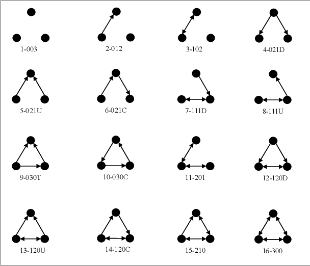

```{r, include = FALSE}
knitr::opts_chunk$set(
  collapse = TRUE,
  comment = "#>"
)
```


```{r setup, include=FALSE}
knitr::opts_chunk$set(
  collapse = TRUE,
  echo = FALSE,
  comment = "#>",
  eval = FALSE,
  echo = TRUE,
  message = FALSE, 
  warning = FALSE
)

```

```{r gt_tables, include = FALSE, eval = TRUE, file='create_tables.R'}
```

```{=html}
<style type="text/css">
.main-container {
  max-width: 1800px;
  margin-left: auto;
  margin-right: auto;
}
</style>
```
```{=html}
<style type="text/css">
pre {
    border-style: hidden;
}
</style>
```


## Terms classification for every Exponential Random Graph Model (ERGM)

Terms can be classified in six main ways.

-   Dyadic independent and dyadic dependent terms: We encounter the
    first one when the probability of edge formation is related to nodes
    properties or attributes; we encounter the second when the
    probability of edge formation depends on other existing edges.

-   Structural and nodal attributes terms: The first kind provides tools
    to understand the structure of the network per se; the second kind
    provides tools to explain how nodal attributes might have influenced
    the formation of edges.

-   Terms for directed networks and terms for undirected networks

-   Exogenous and Endogenous terms: The first one refers to terms using
    covariates, the second to structural terms.

-   Markovian or non-Markovian: a Markovian term measures the structure
    in a network neighborhood

-   Curved (geometrically weighted ) or non-curved: terms that are
    tweaked to improve the model stability

## Binary Exponential Random Graph Model (ERGM)

An ERGM model is performed through the `ergm::ergm` function. The basic
function call is as follows:

```{r ergm }
fit <- ergm::ergm(formula)
```

The formula requires the specification of a network dependent variable,
and a list of terms.

### Most popular structural/endogenous - dyadic independent terms

-   `edges` Extent to which the number of edges in the network
    characterizes the overall structure (Is it a random number of edges,
    or it is the meaningful outcome of a certain phenomenon?).
    Introduces one statistic to the model. Directed and Undirected
    networks.

-   `density` Extent to which the network density characterizes the
    overall structure (Is it a random density, or it is the meaningful
    outcome of a certain phenomenon?). Introduces one statistic to the
    model. Directed and Undirected networks.

-   `sender` Extent to which a specific node, compared to a baseline
    one, is sending out non-random edges (different from the same node's
    behavior in a random distribution). Introduces to the model as many
    statistics as the number of nodes minus one. Directed Networks only.

-   `receiver` Extent to which a specific node, compared to a baseline
    one, is receiving non-random edges (different from the same node's
    behavior in a random distribution). Introduces to the model as many
    statistics as the number of nodes minus one. Directed Networks only.

### Most popular structural/endogenous/Markovian - dyadic dependent terms

-   `mutual` Extent to which ties are more likely to be reciprocated
    than they would be in a random network (controlling for the other
    effects). Introduces one statistic to the model. Directed networks
    only.

-   `asymmetric` Extent to which the observed non reciprocated ties are
    non-random. Introduces one statistic to the model. Directed networks
    only.

-   `triangles` Extent to which the observed triangles are non-random.
    Introduces one statistic to the model. Directed and Undirected
    networks. In the case of directed network measures "transitive
    triple" and "cyclic triple", so triangle equals to `ttriple` plus
    `ctriple`.

-   `triadcensus` Extent to which the sixteen categories in the
    categorization of Davis and Leinhardt (1972) are observed in the
    network and are not generated at random. Introduces 16 statistics to
    the model. Directed networks only.



-   `balance` Extent to which type 102 or 300 in the categorization of
    Davis and Leinhardt (1972) -balanced triads- observed in the network
    are non-random. Introduces one statistic to the model. Directed
    networks only.

-   `transitive` Extent to which type 120D, 030T, 120U, or 300 in the
    categorization of Davis and Leinhardt (1972) -transitive triads-
    observed in the network are non-random. Introduces one statistic to
    the model. Directed networks only.

-   `intransitive` Extent to which type 111D, 201, 111U, 021C, or 030C
    in the categorization of Davis and Leinhardt (1972) -intransitive
    triads- observed in the network are non-random. Introduces one
    statistic to the model. Directed networks only.

-   `degree(n)`, `idegree(n)`, `odegree(n)` Extent to which nodes with a
    specified degree are non random. Introduces one statistic to the
    model. Directed and Undirected networks, with the possibility of
    `in` and `out` specifications for Directed networks.

-   `kstar(n)`, `istar(n)`, `ostar(n)` Extent to which stars connecting
    the specified number of nodes are non random. Introduces one
    statistic to the model. Directed and Undirected networks, with the
    possibility of `in` and `out` specifications for Directed networks.

-   `cycle(n)` Extent to which cycles with a specified number of nodes
    are non-random. Introduces one statistic to the model. Directed and
    Undirected networks.

### Most popular structural/endogenous/curved - dyadic dependent terms

-   `gwesp(decay=0.25, fixed=FALSE)` Geometrically weighted edgewise
    shared partner distribution. It can be used in place of triangles to
    improve convergence. The decay parameter should be non-negative. The
    value supplied for this parameter may be fixed (if `fixed=TRUE`), or
    it may be used instead as the starting value for the estimation of
    decay in a curved exponential family model (when `fixed=FALSE`, the
    default) (see Hunter and Handcock, 2006). This term can be used with
    directed and undirected networks. For directed networks, only
    outgoing two-path (`“OTP”`) shared partners are counted.

-   `dgwesp(decay=0.25, fixed=FALSE, type= 'RTP')` Geometrically
    weighted edgewise shared partner distribution. It also counts other
    types of shared partners not covered by `gwesp`: Outgoing Two-path
    (`“OTP”`), Incoming Two-path (`“ITP”`), Reciprocated Two-path
    (`“RTP”`), Outgoing Shared Partner (`“OSP”`), Incoming Shared
    Partner (`“ISP”`).

-   `gwdegree(decay, fixed=FALSE, attr=NULL, cutoff=30, levels=NULL)`,
    `gwidegree(.5,fixed=T)`, `gwodegree(.5,fixed=T)` Geometrically
    weighted degree distribution. It can be used in place of `degree(n)`
    to improve convergence. Introduces one statistic to the model equal
    to the weighted degree distribution with decay controlled by the
    decay parameter. Directed and Undirected networks, with the
    possibility of `in` and `out` specifications for Directed networks.

### Most popular nodal covariate terms

-   `nodecov`, `nodeicov`, `nodeocov` Numeric or Integer attributes.
    Extent to which the attribute values influence edge formation (same
    as in a logit model) so that it is non-random under that condition.
    Introduces one statistic to the model. Directed and Undirected
    networks, with the possibility of `in` and `out` specifications for
    Directed networks. Dyadic independent.

-   `nodefactor`, `nodeifactor`, `nodeofactor` Categorical attributes.
    Extent to which nodes characterized by a specific category form more
    ties, so that tie formation is non-random under that condition.
    Introduces to the model a number of statistics equal to the number
    of categories minus one. Directed and Undirected networks, with the
    possibility of `in` and `out` specifications for Directed networks.
    Dyadic independent.

-   `absdiff` Numeric or Integer attributes. Extent to which common
    features measured in terms of distance similarity influence edge
    formation, so that edge formation is non-random under that
    condition. Introduces one statistic to the model. Directed and
    Undirected networks. Dyadic independent.

-   `nodematch` Categorical attributes. Extent to which nodes
    characterized by a specific category belonging to a certain
    attribute form ties with other node characterized by the same
    category, so that tie formation under that condition is non-random.
    Introduces to the model as many statistics as the number of
    categories. Directed and Undirected networks. Dyadic independent.
    ---Differential homophily

-   `edgecov` Matrix attribute. Extent to which the ties formed in
    another context influence tie formation in the context of the
    current model, so that tie formation under that circumstances is
    non-random. Introduces one statistic to the model. Directed and
    Undirected networks. Dyadic dependent.

-   `nodemix` Categorical attributes. Extent to which nodes denoted by
    different categories of an attribute form ties, so that tie
    formation under these circumstances is non-random. Introduces as
    many statistics as the number of combinations between every two
    categories. Directed and Undirected networks. Dyadic independent.

### Terms specifications

Use the argument `levels` within the term specification for selecting
the baseline or reference category.

Example: set female as a reference category.

```{r}
fit <- ergm::ergm(Net ~ edges + nodefactor('sex', levels = -(2)))
```

### Searching for terms

You can look for additional terms with

```{r}
search.ergmTerms(keyword, net, categories, name)
```

You have four arguments to help you finding terms:

-   `keyword` optional character keyword to search for in the text of
    the term descriptions. Only matching terms will be returned.
    Matching is case insensitive.

-   `net` a network object that the term would be applied to, used as
    template to determine directedness, bipartite, etc

-   `categories` optional character vector of category tags to use to
    restrict the results (i.e. 'curved', 'triad-related') --see
    categorization of terms in the manual

-   `name` optional character name of a specific term to return

### Checking your data before the analysis

Before you run any exponential random graph model you must know your
data by heart. Not only using descriptive network statistics, but also
checking model specifications, before hitting the run button.

-   Manually check the attribute(s) (numeric, integer, categorical,
    ordinal)

```{r}
table(snafun::extract_vertex_attribute(Net, 'sex'))
```

-   check mixing of categorical attributes

```{r}
snafun::make_mixingmatrix(Net, "sex")
```

-   check model statistics.

```{r}
summary(Net ~ edges + nodefactor('sex'))
```

This last one provides the number of observed cases under the
assumptions of each term.

### Reading results

You interpret ERGM results as logit models results. Two options:

-   Compute odd ratios for each coefficient

```{r}
OR <- exp(coef)
```

-   Compute probability for each coefficient

```{r}
P <- exp(coef) / (1 + exp(coef))
```

-   Compute odd ratios using the `SNA4DS` function

```{r}

OR <- snafun::stat_ef_int(m)

```

-   Compute probability using the `snafun` function

```{r}

P <- snafun::stat_ef_int(m, type = "probs")

```

### Simulating networks

It is sometimes helpful to simulate networks with the same features at
the one you observed in real life.

-   Simulating a network from a model

```{r}
fit <- ergm::ergm(Net ~ edges)
simfit <- simulate(fit, burnin = 1e+6, verbose = TRUE, seed = 9)
```

-   simulate network fixing the coefficient results

```{r}

RandomNet <- network::network(16,density=0.1,directed=FALSE)

sim <- simulate(~ edges + kstar(2), nsim = 2, coef = c(-1.8, 0.03),
                  basis = RandomNet,
                  control = ergm::control.simulate(
                    MCMC.burnin=1000,
                    MCMC.interval=100))
sim[[1]]
```

### MCMC Diagostics

You can check the Monte Carlo Markov Chains diagnostic for your dyadic
dependent model using the function:

```{r}
ergm::mcmc.diagnostics(fit)
```

### Goodness of Fit

You can check the goodness of fit of your model using the function

```{r}
ergm::gof(fit)
```

You can also plot your `gof` output

```{r}
plot(ergm::gof(fit))
```

or, making use of your new best friend (the `snafun` package):

```{r}
snafun::stat_plot_gof(fit)
stat_plot_gof_as_btergm(fit)
```

<br><br><br>

## Bipartite ERGMs

A bipartite ERGM works exactly the same way as a binary one. However, in
order to make it handle data differentiating between two partitions, it
is necessary to use some specially defined terms. Moreover, you will
need to specify the model with more advanced settings since it is
computationally more demanding.

### Importing Bipartite ERGMs

Since you are using the same function as binary ERGM (`ergm::ergm`) to
run the model, it is necessary to make sure that the software knows that
it needs to handle a bipartite structure.

#### Step one: Specify the incidence matrix

The data that contains bipartite network information needs to be
specified into a partition 1 X partition 2 data frame or matrix.

If 10 people attend 4 events, the incidence matrix will have dimensions
10 X 4.

#### Step two: Import the network as a bipartite

You can import the network as bipartite using these specifications.

```{r}

BipNet <- network::network(BipData, directed = FALSE, bipartite = TRUE)

```

#### Step three: Import the attributes

You can import the attributes using this code. The attribute vector
needs to contain as many elements as Partition 1 + Partition 2. However,
it is unlikely to have an attribute that makes sense for both partitions
at the same time.

Make sure to insert the information that concerns partition 1 and
afterward the information that concerns partition 2.

Make sure to code as `NA` the entry for the partition for which you do
not have information.

For instance, if we have one attribute for partition one in a network
with 10 nodes in partition 1 and 4 in partition 2, we will have the
first ten digits storing information about nodes in partition 1 and 4
NAs for partition 2.

```{r}

# vertex.names <- vector of names
attrib1 <- as.character(c(0, 0, 0, 0, 0, 1, 1, 1, 1, 1, NA, NA, NA, NA))

snafun::add_vertex_attributes(BipNet, "vertex.names",  vertex.names)
snafun::add_vertex_attributes(BipNet, "attrib1",  attrib1)

```

#### Step four: Bipartite extra info

In order to make sure that the software correctly reads your bipartite
network, you need to code an extra attribute.

The attribute focuses on partition one. For example, if we have 10 nodes
in partition 1 we will use:

```{r}

snafun::add_vertex_attributes(BipNet, "bipratite", value = rep(10, 10), v = 1:10)

```

Note: `bipratite`, yes, it is a typo, but a typo in the package. Hence
make sure you misspell it; otherwise, you will get an error. (FUN FACT!)

### Terms for Bipartite ERGMs

Bipartite ERGMs terms are provided at the same time for both partitions
since it is relevant to consider the same structure from both
perspectives.


You can find the full list of bipartite terms by running:

```{r}

ergm::search.ergmTerms(categories = "bipartite")

```

They are 32 in total, so it is manageable.

#### The most popular terms are:

-   `b1star(k)` & `b2star(k)` -- `star(k)` for binary ERGMs

-   `gwb1dsp()` & `gwb2dsp()` -- same as `gwdsp()` for binary ERGMs

-   `b1cov` & `b2cov` -- same as `nodecov()` for binary ERGMs

-   `b1factor` & `b2factor` -- same as `nodefactor()` for binary ERGMs

-   `b1nodematch` & `b2nodematch` -- same as `nodematch()` for binary
    ERGMs

### Specifying advanced options

Since a bipartite ERGM is computationally more demanding than a regular
one, you need to make sure you specify the advanced options offered by
the `ergm` package.

#### Constraints

Constraints are options that allow you to set limits your simulation
takes into account

For instance, you can limit the simulation setting a min and a max
degree.

`constraints= ~ bd(minout = 0, maxout = 7)`

For instance,

```{r}
m <- ergm::ergm(BipNet ~ edges  + b1factor("attr1", levels = -1) + b1star(2),
                 constraints= ~ bd(minout = 0, maxout = 7))
```

There are many other constraints that it is possible to use

#### Control

Controls are options that allow you to be aware of what your simulation
is doing to a larger extent and, for this reason, to make it faster.

There are several options. For instance,

-   `MCMC.burnin` - ignore than many chains before starting to estimate
    parameters

-   `MCMC.samplesize` - collect that number of information from the
    previous state in order to inform the following one

-   `seed` - makes the simulation go the same way every time it is run

-   `MCMLE.maxit` - breaks the algorithm after that number of attempts.

For instance,

```{r}
m <- ergm::ergm(BipNet ~ edges  + b1factor("attr1", levels = -1) + b1star(2),
                 constraints= ~ bd(minout = 0, maxout = 7),
                 control = ergm::control.ergm(MCMC.burnin = 5000,
                                              MCMC.samplesize = 10000,
                                              seed = 1234,
                                              MCMLE.maxit = 20))
```

<br><br><br>

## Weighted ERGMs

A weighted network is a network where the edges express the weight or
the intensity of the relationship.

It is still unimodal, but it contains more information.

In order to use weighted ergms, the network needs to be fully connected.

Different kinds of weights require different models. You need to check:

-   what kind of variable type characterizes your weights (integer,
    count, numeric, ordinal...)
-   what kind of distribution does your weight have

The `GERGM` package works with fully connected networks and
(theoretically ) every kind of weight variable.

The `GERGM` package does not recognize either the `network` or the
`igraph` classes.

You need to work with weighted adjacency matrices (NxN - squared, that
has inside the weight, rather than 0s and 1s).

### Documentation

Installation:

`remotes::install_github("matthewjdenny/GERGM", dependencies = TRUE)`

User manual

`https://github.com/matthewjdenny/GERGM`

Vignette

Run `browseVignettes("GERGM")`in the R console

### Most popular endogenous terms (Markovian and Curved)

-   `twostars`, equivalent to `star(2)` in `ergm`

-   `out2stars`, equivalent to `ostar(2)` in `ergm`

-   `in2stars`, equivalent to `istar(2)` in `ergm`

-   `ctriads`, same as in `ergm`

-   `mutual`, same as in `ergm`

-   `ttriads`, same as in `ergm`

Convergence problems? Use exponential down-weighting. AKA "curve" the
terms:

E.g., `out2stars(alpha = 0.25)` - default = 1

### Most popular exgenous terms

-   `absdiff(covariate = "MyCov")`

-   `sender(covariate = "MyCov")` -- different from `ergm`, here you can
    insert an attribute

-   `receiver(covariate = "MyCov")` -- different from `ergm`, here you
    can insert an attribute

-   `nodematch(covariate = "MyCov", base = "Ref.cat")`

-   `nodemix(covariate = "MyCov", base = "Ref.cat")`

-   `netcov(network)` -- like `edgecov` in `ergm`

### Running the model

First, we specify the formula,

```{r}
formula <- adjacencyMatrix ~ edges +
  sender("myCov") +
  receiver("myCov") +
  netcov(otherAdjMat) +
  mutual(alpha = .9)
```

Then we run the model

```{r}

set.seed(5)
gergmResults <- GERGM::gergm(formula,
                      estimation_method = "Metropolis", # chose the algorithm to estimate the model
                      covariate_data = covariateData, # passing attributes on
                      number_of_networks_to_simulate = 100000, # same as ergm
                      MCMC_burnin = 10000, # same as ergm
                      thin = 1/10, # retaining only a small number of simulated Networks in the computer memory
                      transformation_type = "Cauchy") # distribution of the weight

```

The `GERGM::gergm` function automatically prints results while it runs.
However, it is also possible to print them again separately.

#### Plotting MCMC diagnostics

`GERGM::Trace_Plot(gergmResults)`

#### Plotting the Goodnes of fit

`GOF(gergmResults)`

#### Plotting the results

`GERGM::Estimate_Plot(gergmResults)`

#### Printing a table with standard errors and coefficients

```{r}
(EstSE <- rbind(t(attributes(gergmResults)$theta.coef),
                t(attributes(gergmResults)$lambda.coef)))
```

#### Significance

`GERGM` models use confidence intervals instead of p-values.

You can estimate the confidence interval using this formula

```{r}
lower = coef - SE*(-qnorm((1 - 0.95)/2))
upper = coef + SE*(-qnorm((1 - 0.95)/2))
```

If the lower and the upper intervals are both negative or both positive,
the coefficient is significant.

If the lower and the upper intervals have different sign, the
coefficient is not significant.

<br><br><br>

