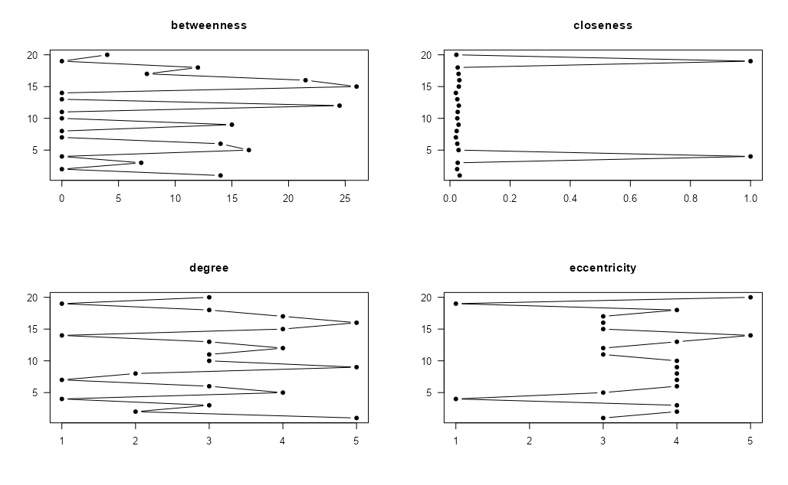

```{r, include = FALSE}
knitr::opts_chunk$set(
  collapse = TRUE,
  comment = "#>"
)
```


```{r setup, include=FALSE}
knitr::opts_chunk$set(
  collapse = TRUE,
  echo = FALSE,
  comment = "#>",
  eval = FALSE,
  echo = TRUE,
  message = FALSE, 
  warning = FALSE
)

```

```{r gt_tables, include = FALSE, eval = TRUE, file='../inst/extdata/create_tables.R'}
```

```{=html}
<style type="text/css">
.main-container {
  max-width: 1800px;
  margin-left: auto;
  margin-right: auto;
}
</style>
```
```{=html}
<style type="text/css">
pre {
    border-style: hidden;
}
</style>
```


# Plotting

## Plotting in `snafun`

The `snafun` package provides S3 plotting methods, which means that a
plain call to `plot(x)` allows the user to make a quick plot of a
network, regardless of whether `x` is a graph of class `network` or
`igraph`. These methods wrap `network::plot.network` and
`igraph::plot.igraph` and will use the default settings of these
functions.

However, one can also use all of the arguments from
`network::plot.network` and `igraph::plot.igraph` to make the plots
nicer when wanted.

Here is an example for a `network` object.

```{r snafun_plot_nw, echo = TRUE, eval = TRUE}
g_n <- snafun::create_random_graph(10, "gnm", m = 20, graph = "network")
plot(g_n)
plot(g_n, vertex.cex = 3, vertex.col = "green", edge.lwd = 10, 
  edge.col = "darkgrey", usecurve = TRUE, edge.curve = .05, 
  arrowhead.cex = 3, displaylabels = TRUE, label.pos = 5)
```

And for an `igraph` graph object:

```{r snafun_plot_ig, echo = TRUE, eval = TRUE}
g_i <- snafun::create_random_graph(10, "gnm", m = 20, graph = "igraph")
plot(g_i)
plot(g_i, vertex.size = 12, vertex.color = "green", edge.width = 5, edge.curved = TRUE)
```

The most common use case for the function is to make as quick plot of
the network, using default settings, as one usually would do in the
initial phase of a study. For this, `snafun` provides a consistent
function name.

The `snafun` package also contains a function to plot centrality scores
of the vertices. The function and its options are specified as follows:

```{r, echo = TRUE}
snafun::plot_centralities(
  net,
  measures = c("betweenness", "closeness", "degree", "eccentricity"),
  directed = TRUE,
  mode = c("all", "out", "in"),
  k = 3,
  rescaled = FALSE,
  ...
)
```

This yields a plot like this:

```{r plot_centralities, echo=FALSE, eval = TRUE}

```

The function takes an object of class `igraph` or `network` and plots
the centrality scores you select, so you can visually compare them. Make
sure to pick the required value for `mode` (the default is "all").

## Plotting with the unified `snafun` interface

In most teaching situations, it is simpler to use the same `plot()`
call regardless of whether the object is `igraph` or `network`. The
appropriate S3 method is selected automatically.

```{r, echo = TRUE}
plot(net,
     edge.arrow.size = .2,                # edge and arrow size
     edge.color = "red",                  # edge color
     vertex.color = "blue",               # vertex filling color
     vertex.frame.color = "green",        # vertex perimeter color
     vertex.label = snafun::extract_vertex_names(net), # vertex labels
     vertex.label.cex = 0.6,              # vertex label size
     vertex.label.color = "black")        # vertex label color
```

If you want to use the underlying backend functions directly, you still
can, but for most purposes `plot(net, ...)` is the easier and more
consistent choice in `snafun`.

<br><br><br>
