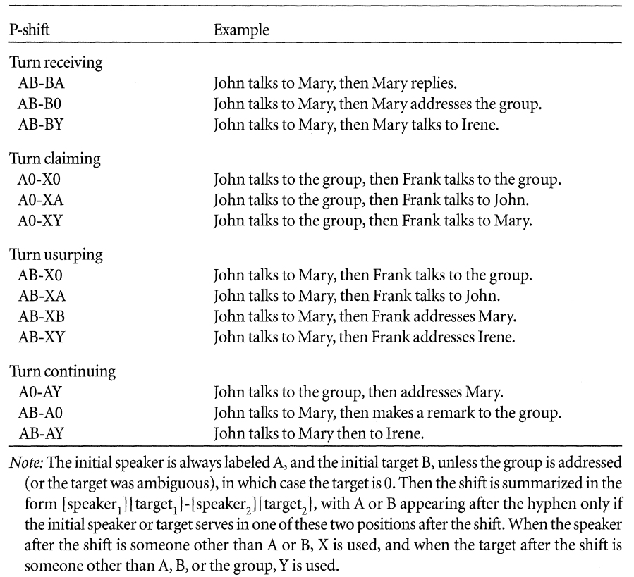

```{r, include = FALSE}
knitr::opts_chunk$set(
  collapse = TRUE,
  comment = "#>"
)
```


```{r setup, include=FALSE}
knitr::opts_chunk$set(
  collapse = TRUE,
  echo = FALSE,
  comment = "#>",
  eval = FALSE,
  echo = TRUE,
  message = FALSE, 
  warning = FALSE
)

```

```{r gt_tables, include = FALSE, eval = TRUE, file='create_tables.R'}
```

```{=html}
<style type="text/css">
.main-container {
  max-width: 1800px;
  margin-left: auto;
  margin-right: auto;
}
</style>
```
```{=html}
<style type="text/css">
pre {
    border-style: hidden;
}
</style>
```


# Temporal networks (exploration and description)

The main packages to use in this course for descriptive and exploratory
analysis of temporal networks are `networkDynamic` to construct and
manipulate temporal networks), `tsna` (for `sna`-like network measures),
and `ndtv` (for visualization).

Edges will typically have a starting time (`onset`), and end time
(`terminus`), a duration, a sender (`tail`), and a receiver (`head`). of
course, edges can start and end multiple times during the observation
period and can have durations of length 0 up until any positive number.

The temporal networks are of class `networkDynamic`.

## Network generation and manipulation

-   `networkDynamic::networkDynamic`: construction of a temporal
    network. There are many ways in which you can construct a temporal
    network. A common way is to first construct a network that has the
    vertex names, any vertex static attributes, edge attributes, whether
    the network is directed, et cetera. <br> This network is called
    `base.net` and is used by this function to extract the basic aspects
    of the network. Don't worry that some values (e.g., vertex
    attributes) may change over time, because any temporal info you add
    to this function will override what is in `base.net`. But `base.net`
    is an excellent and efficient way to provide much data to the
    function about the temporal network and it more cumbersome to add
    that later on. <br> Further, you can provide dynamic data through
    `data.frame`s for vertices and for edges in several ways. Consult
    the `help` function for the details, as this vignette would become
    far too long otherwise.
-   `as.data.frame(g)` Extract the dynamic edge info from the network,
    as a `data.frame`.

Most of the functions below allow you to specify a time segment you are
interested in. Typically, these include `onset`, `terminus`, `length`,
and `at`. Below, we give only one example of how each function can be
specified.

-   `networkDynamic::list.vertex.attributes.active(g, onset = 5, terminus = 8)`
    List the attributes of the vertices that are active in a specific
    time segment.

-   `networkDynamic::get.vertex.attribute.active(g, "attrName", at = 1)`
    The value for vertex attribute `attrName` in a specific time
    segment.

-   `networkDynamic::list.edge.attributes.active(g, onset = 0, terminus = 49)`
    List the attributes of the edge that are active in a specific time
    segment.

-   `networkDynamic::get.edge.attribute.active(g, "attrName", at = 1)`
    The value for edge attribute `attrName` in a specific time segment.

-   `networkDynamic::network.extract(classroom, onset = 0, terminus = 1)`
    Extract the part of the temporal network for a specific time
    segment.

-   `networkDynamic::network.collapse(classroom, onset = 0, terminus = 1)`
    Collapse the temporal network into a static network based on the
    activity within a specific time segment.

-   `networkDynamic::activate.vertex.attribute`,
    `networkDynamic::activate.edge.attribute`, `activate.edge.value`,
    `activate.network.attribute` Set or modify attributes within a
    specific time segment.

-   `deactivate.vertex.attribute`, `deactivate.edge.attribute`,
    `deactivate.network.attribute` Make an attribute inactive during a
    specific time segment.

NOTE: The functions above for accessing and setting the attributes of a
`networkDynamic` object are not very user friendly. Luckily, you can
also access and/or set attributes using the `network` package or the
`snafun` package like in the [network manipulation
table](#manipulate%7D). As long as you want to access and/or set
attributes that are *static*, this works much easier and uses functions
that you have used multiple times already in this course and should be
second nature to you by now.

## Network measures and descriptives

-   `networkDynamic::duration.matrix(g, changes, start, end)` This
    function takes a given temporal network `g`, a matrix with columns
    "time", "tail", "head" (this matrix is called a *toggle list*), and
    a start and end time. It returns a `data.frame` a list of edges and
    activity spells. A toggle represents a switch from active state to
    inactive, or vice-versa.

-   `network.size(g, onset = 5, length = 10)`. The size of a network
    during a specific time segment.

The following functions provide useful descriptives of durations in the
temporal network.

-   `tsna::edgeDuration(g, mode = "duration")` or
    `tsna::edgeDuration(g, mode = "counts")` Sums the activity duration
    or number of edge events in a time segment.

-   `tsna::vertexDuration(g, mode = "duration")` or
    `tsna::vertexDuration(g, mode = "counts")` Sums the activity
    duration or number of vertex events in a time segment.

-   `tsna::tiedDuration(g, mode = "duration")` Measures the total amount
    of time each vertex has ties.

-   `tsna::tiesDuration(g, mode = "counts")` Computes the total number
    of edge spells each vertex is tied by.

The functions `tsna::tEdgeFormation` and `tsna::tEdgeDissolution`
compute the number of edges forming or dissolving at time points over a
time segment. If `result.type = 'fraction'` the fraction of the number
of edges formed (or dissolved) is computed.

-   `tsna::tEdgeFormation(g, start = 1, end = 4, time.interval = 1)`

    Counts at times 1, 2, 3, and 4.

-   `tsna::tEdgeDissolution(g, start = 1, end = 4, time.interval = 1)`

    Counts at times 1, 2, 3, and 4.

### Calculating measures from `sna` over time

You can calculate any measure from the `sna` package on a collapsed time
segment or a series of collapsed time segments through the
`tsna::tSnaStats` function. These measures can be vertex level
statistics (e.g., `sna:betweenness`) or graph-level measures (e.g.,
`sna::grecip`). You specify which function you want to calculate and the
time segments they should be calculated on. The function returns a time
series, which makes the outcomes easy to plot.<br> For example, you want
to calculate transitivity of intervals that are 5 time points wide. The
following function calculates transitivity for time intervals [0-5),
[5-10), [10-15), etc:

`tsna::tSnaStats(g, snafun = "gtrans", time.interval = 5, aggregate.dur = 5)`

This can cause some sudden shifts of values, so it is often more
informative to use overlapping segments. So, let us calculate density
for windows of width 0, at intervals of 3. This calculates density for
intervals 0-10, 3-13, 6-16, et cetera:

`tsna::tSnaStats(g, snafun = "gden", time.interval = 3, aggregate.dur = 10)`

### Calculating `ergm` terms over time

The `tsna` also allows you to compute `ergm` terms for specific time
segments. Because the model terms provided by the `ergm` package (and
its various add-ons) are 'change statistics' (that determine the effect
of changing a single tie on the overall network structure), you can use
these terms to describe the network within specific time segments. You
specify which terms you want to calculate using a formula.

For example,

`tsna::tErgmStats(g,'~edges + degree(c(1, 2))', start = 3, end = 10)`

calculates the number of edges (*edges*) and the values for *degree(1)*
and *degree(2* for each specified time segment. The output is a time
series (with a column for each statistic) and can simply be plotted
using `plot`. This plots the time series for each term above the others,
so you can see how all of them develop over time.

```{r, echo = TRUE, eval = TRUE}
data(windsurfers, package = "networkDynamic")

plot(tsna::tErgmStats(windsurfers,'~edges + degree(2) + kstar(3)',
                      aggregate.dur = 5), main = "ERGM terms over time")
```

In the lecture, we discussed *participation shifts*--also known as
*p-shifts*. Gibson (2003) defined 13 P-shifts, and the
`tsna::pShiftCount` function can count how often each type occurs in a
specific time segment. This is how Gibson describes each of the thirteen
types:

```{r, eval = TRUE}

```

### Participation shifts

-   `tsna::pShiftCount(g, start = 1, end = 3)` Calculates the number of
    times each of the above P-shifts occurred during the specified time
    segment. In other words, this calculates the *P-shift census*.

### Temporal paths

The `tsna::tPath` function calculates the set of temporally reachable
vertices from a given source vertex starting at a specific time.

-   `tsna::tPath(g, v = 12, direction = "fwd", start = 0, end = 3)` This
    calculates the temporal paths from vertex 12 to all other vertices,
    from the start of the specified time segment. When
    `direction = "bkwd"`, it determines the paths *to* vertex 12. You
    can further specify whether you will find the paths that arrive the
    first or the ones that leave the vertex at the latest possible
    times.

The generally most relevant parts of the resulting object are:

-   `tdist` The time each specific path takes. When a path does not
    exist, the value if Inf.

-   `gsteps` The length of the path (in terms of the number of steps).
    When a path does not exist, the value if Inf.

The `tsna::plotPaths` plots the network and highlights the calculated
temporal paths from the chosen vertex (vertex 12, in the example above).
It can also add a label to each edge, so you can see how much time it
takes for that edge to be activated from this focal vertex. You can
tweak the plot like you would tweak any network plot of class `network`.

```{r, echo = TRUE}
tsna::plotPaths(
  g,
  paths = tsna::tPath(g, v = 12, direction = "fwd", start = 0, end = 3),
  displaylabels = FALSE,        # remove the vertex labels, to prevent too much visual clutter
  vertex.col = "white",
  edge.label.cex = 1.5          # the color of the printed times
)
```

A related concept is that of "temporal reachability." The `tsna::tReach`
function computes, for each vertex, the number of vertices that are
temporally reachable over the entire observation period.\<\br\> If you
want to compute this for a specific time segment, first use
`networkDynamic::network.extract` to extract the segment of interest and
then feed this to the `tsna::tReach` function.

-   `tsna::tReach(g, direction = "fwd", start = 10, end = 20)` The
    function to calculate the temporal reachable sets using only
    temporally forward steps (you can also specify `direction = "bkwd"`
    to determine by how many vertices each vertex can be temporally
    reached).

## Network visualization

Temporal networks can be visualized in two ways. First, static plots can
be made of a temporal network, either by collapsing the temporal network
into a static network (or to break up the temporal network into static
networks of specific time segments).

### Visualizing as static networks

An obvious way to visualize the entire temporal network as a static
network is to simply use `plot(g)`.

Alternatively, the temporal network can be collapsed into smaller time
segments and plot these the network slices as static representations.

There are two functions that can do this. The `ndtv` package has the

`ndtv::filmstrip` that does this as follows:

-   `ndtv::filmstrip(g, frames = 9)` This plots the network at 9 points
    in time. It does *not* provide an overview of how the network
    changes over time, but it provides a series of snapshots (9, in this
    example) of the network. If the timing of the edges is in continuous
    time, this function has the tendency to plot nearly empty graphs, as
    it evaluates the networks at specific time *points*, rather than
    time *intervals*.

The `snafun` package implements a function that divides the specified
time period into time segments of equal time length and plots each
segment as a static network. This is useful to see how the network
changes over time. It also works nicely for networks where changes
happen in continuous time.

```{r}
snafun::plot_network_slices(9, number = 93)
```

A sometimes useful function is `ndtv::proximity.timeline`, which shows
the distance between the edges over time. The main purpose is to see how
the edges move vis-a-vis each other over time (based on the geodesic
path distance) and it often helps to see where and when subgroups are
forming over time.

The function call is:

```{r}
ndtv::proximity.timeline(g,  start = 10, end = 50,
                         time.increment = .5,
                         mode = 'isoMDS')
```

where you can change the *mode* to a different scaling algorithm. For
actual research projects, you want to try various settings and check
which gives you the most informative output for the data at hand.

The function allows you to set many arguments (such as labels and
colors).

### Visualizing as a dynamic network animation

The `ndtv` package includes functions to create an animation of how the
network unfolds over time. There are many arguments you can tweak, so
here we only focus on the main approach. Make sure to consult the
package help for more details.

There are two steps in creating a dynamic visualization in `ndtv`: you
first run `ndtv::compute.animation`, which determines coordinates and
other aspects of the dynamic plot. Second, you run
`ndtv::render.d3movie`, which, you guessed it, renders the actual
movie.<br>

```{r compute, exercise = TRUE, exercise.lines = 21}
# step 0: unfortunately, we have to load the package into our session
library(ndtv)

# step 1: compute the settings
ndtv::compute.animation(g, animation.mode = "kamadakawai",
                        slice.par = list(start = 0, end = 45,
                                         aggregate.dur = 1,
                                         interval = 1, rule = "any"))

# step 2, render the animation
ndtv::render.d3movie(g, usearrows = TRUE, displaylabels = FALSE ,
                     bg = "#111111",
                     edge.col = "#55555599",
                     render.par = list(tween.frames = 15,
                                       show.time = TRUE),
                     d3.options = list(animationDuration = 1000,
                                       playControls = TRUE,
                                       durationControl = TRUE),
                     output.mode = 'htmlWidget'
                     )
```

Some important arguments for `ndtv::render.d3movie` include:

-   `launchBrowser`: defaults to TRUE: determines whether the animation
    will be shown in the Browser after rendering.

-   `output.mode`: the kind of output you want (defaults to 'HTML')

-   `filename`: The file name of the HTML or JSON file to be generated.
    Only relevant if you picked 'HTML' or 'JSON' as output.mode.

Further, you can set most of the common graphical parameters, such as
`vertex.col`, `label.cex`, `use.arrows`, `edge.lwd`, et cetera.

If you want to fix vertices to the same location throughout the
animation, you do this as follows

```{r}
# use some way to determine a matrix of vertex locations
coords <- ndtv::network.layout.animate.kamadakawai(g)

# add the x and y coordinates as vertex attributes
# adapt onset and terminus if required
networkDynamic::activate.vertex.attribute(g, "x", coords[, 1],
                                          onset = -Inf, terminus = Inf)

networkDynamic::activate.vertex.attribute(g, "y", coords[, 2],
                                          onset = -Inf, terminus = Inf)

# compute the new animation settings
# We now use `animation.mode = "useAttribute"`
ndtv::compute.animation(g, animation.mode = "useAttribute",
                        slice.par = list(start = 0, end = 45,
                                         aggregate.dur = 1,
                                         interval = 1, rule = "any"))
```
